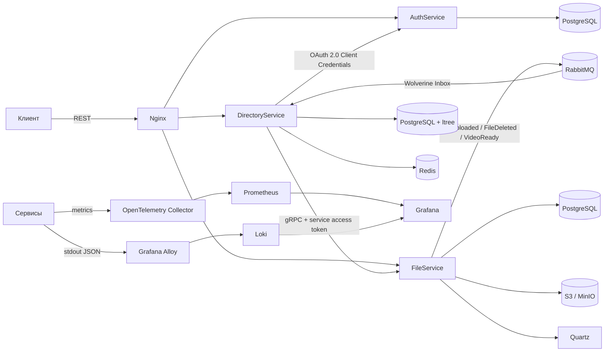
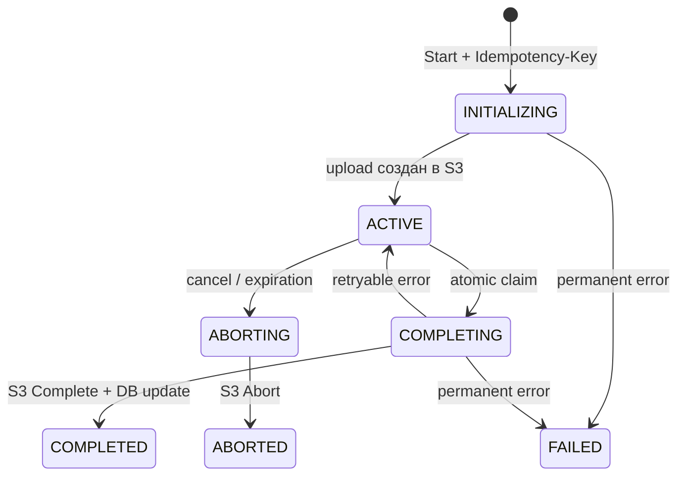
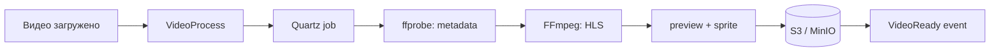

# Directory Backend

> Учебно-практическая backend-система на .NET: оргструктура, файлы и видео, OAuth 2.0 / OpenID Connect, межсервисные интеграции и сценарии частичных отказов.


Система моделирует backend внутренней платформы компании: хранит иерархию подразделений, связывает с ними файлы, обрабатывает загруженные видео и централизованно управляет пользовательской и межсервисной аутентификацией.

Проект нужен мне как практическая база для глубокого изучения backend-разработки. Я не ограничиваюсь работающим happy path: разбираю problem cases, проектирую границы сервисов, проверяю конкурентный доступ, retry, timeout и partial failure, пишу тесты и постепенно усиливаю архитектуру по мере появления новых требований.

## Что демонстрирует проект

- проектирование ASP.NET Core-сервисов с разделением Domain, Application/Core, Infrastructure и Web;
- работу с PostgreSQL не только как с CRUD-хранилищем: `ltree`, транзакции, блокировки, условные обновления и индексы;
- выбор между REST, gRPC и асинхронными событиями в зависимости от сценария;
- проектирование отдельной общей библиотеки и публикацию переиспользуемых компонентов как NuGet packages;
- multipart upload в S3-совместимое хранилище с идемпотентностью и явной state machine;
- фоновые и восстанавливаемые процессы на Quartz, включая FFmpeg-конвейер обработки видео;
- OAuth 2.0 / OpenID Connect для пользовательских и service-to-service сценариев;
- Transactional Outbox/Inbox, кэширование, health checks, метрики и структурированные логи;
- unit- и integration-тесты с реальными PostgreSQL и MinIO в Testcontainers.

## Граница репозитория

В этом репозитории находятся исходники трех сервисов: [AuthService](backend/AuthService), [DirectoryService](backend/DirectoryService) и [FileService](backend/FileService), а также их Docker-инфраструктура и тесты.

Переиспользуемые `Result`, ошибки, middleware и messaging-контракты поставляются пакетами `IstredDev.*`. Их исходники развиваются отдельно в [SharedService](https://github.com/EugenTovarchi/SharedService) и не выдаются здесь за часть этого репозитория.

Основная разработка ведется в GitLab: там хранится рабочая история проекта и публикуются используемые сервисами NuGet packages `IstredDev.*`. Этот GitHub-репозиторий подготовлен как публичная portfolio-версия системы — для просмотра архитектуры, кода и инженерных решений работодателями и другими разработчиками.

### SharedService: отдельная библиотека

[SharedService](https://github.com/EugenTovarchi/SharedService) — спроектированная отдельно библиотека общих backend-компонентов. Она вынесена из сервисов намеренно: универсальные примитивы развиваются и версионируются независимо, а AuthService, DirectoryService и FileService подключают их как NuGet packages через приватный GitLab Package Registry.

Библиотека разделена по уровню ответственности:

- `IstredDev.SharedKernel` — `Result`/`Failure`, базовые исключения, общие integration events и правила маршрутизации сообщений;
- `IstredDev.Framework` — преобразование результатов в HTTP-ответы, endpoint abstractions, exception handling и correlation middleware;
- `IstredDev.Core` — сервис-независимые application-примитивы.

Такое разделение позволяет не копировать инфраструктурный код между микросервисами и одновременно не связывать общую библиотеку с доменной моделью конкретного сервиса.

### Central Package Management

Для всех проектов репозитория настроен [Directory.Packages.props](Directory.Packages.props) с `ManagePackageVersionsCentrally`. Файлы `.csproj` объявляют только нужные `PackageReference`, а версии внешних зависимостей и собственных packages `IstredDev.*` управляются в одном месте. Это снижает риск расхождения версий между сервисами, делает обновления зависимостей обозримыми в одном diff и позволяет явно контролировать совместимость общих контрактов.

[Directory.Build.props](Directory.Build.props) дополняет эту схему общими build-настройками: `net9.0`, nullable reference types, единый analysis level и набор Roslyn-анализаторов применяются ко всем проектам автоматически. На практике я получил опыт не только подключения NuGet-пакетов, но и их проектирования, версионирования, публикации в package registry и централизованного сопровождения в multi-project solution.

## Архитектура



Сервисы владеют собственными данными. Синхронный запрос сведений о видео выполняется через gRPC, а изменение состояния файла распространяется событием через RabbitMQ. Между PostgreSQL и S3 нет общей ACID-транзакции, поэтому FileService опирается на сохраняемые состояния, идемпотентные переходы, компенсацию и recovery.

| Сервис | Ответственность | Ключевые технологии |
|---|---|---|
| **AuthService** | пользователи, роли, сессии, OAuth 2.0 / OpenID Connect | ASP.NET Core Identity, OpenIddict, PostgreSQL, Quartz |
| **DirectoryService** | дерево подразделений, права, привязка файлов | EF Core, Dapper, PostgreSQL `ltree`, HybridCache, Redis |
| **FileService** | загрузка файлов, S3, обработка видео | MinIO/S3, gRPC, RabbitMQ, Wolverine, Quartz, FFmpeg |

## DirectoryService

Иерархия подразделений хранится как materialized path в PostgreSQL `ltree`. Это позволяет выполнять ancestor/descendant-запросы средствами базы, а не загружать дерево в память. В [DepartmentRepository](backend/DirectoryService/DirectoryService.Infrastructure.Postgres/Repositories/DepartmentRepository.cs) EF Core отвечает за обычную работу с сущностями, а параметризованный Dapper/SQL — за специализированные операции над поддеревом.

Несколько показательных решений:

- [перемещение подразделения](backend/DirectoryService/DirectoryService.Application/Commands/Departments/MoveDepartment/MoveDepartmentHandler.cs) меняет пути всего поддерева в транзакции;
- команды и запросы разделены по application-сценариям, а endpoints остаются тонкими;
- `HybridCache` использует Redis как распределенный слой; инвалидация привязана к тегам подразделений и файлов;
- `FileUploaded` и `FileDeleted` обрабатываются через [durable Wolverine Inbox](backend/DirectoryService/DirectoryService.Application/Messaging/WolverineConfiguration.cs);
- доступ к операциям ограничивается permissions/policies, а внутренний gRPC-вызов FileService получает service token по Client Credentials;
- сведения о готовом видео запрашиваются через [gRPC client](backend/FileService/FileService.Contracts/HttpCommunication/FileCommunicationClient.cs) и кэшируются только для состояния `Ready`.

## FileService и multipart upload

Клиент не передает крупный файл через API целиком. FileService создает multipart upload в S3/MinIO и возвращает presigned URL для каждой части. Сессия сохраняется в PostgreSQL как [MultipartUploadSession](backend/FileService/FileService.Domain/Uploads/MultipartUploadSession.cs) со статусами `INITIALIZING`, `ACTIVE`, `COMPLETING`, `COMPLETED`, `ABORTING`, `ABORTED`, `EXPIRED`, `FAILED`.



`Idempotency-Key` защищен уникальным ограничением: повторный Start возвращает уже созданную сессию. Complete и Abort сначала захватывают право на выполнение условным `UPDATE`; решение принимается по числу затронутых строк, поэтому два экземпляра сервиса не должны одновременно финализировать одну загрузку. Реализация находится в [CompleteMultipartUploadEndpoint](backend/FileService/FileService.Core/Features/CompleteMultipartUploadEndpoint.cs) и [MultipartUploadSessionsRepository](backend/FileService/FileService.Infrastructure.Postgres/Repositories/MultipartUploadSessionsRepository.cs).

Если ответ S3 на Complete неоднозначен, сервис проверяет существование объекта. Retryable-ошибка возвращает сессию в `ACTIVE`, устаревший claim может быть восстановлен по timeout, а [cleanup service](backend/FileService/FileService.Infrastructure.Postgres/Background/MultipartUploadCleanupService.cs) завершает зависшие или просроченные операции.

## Обработка видео

После загрузки видео создается сохраняемый `VideoProcess`. Каждый шаг конвейера имеет собственное состояние, поэтому процесс можно продолжить после перезапуска приложения.



[VideoProcessingJob](backend/FileService/FileService.VideoProcessing/Quartz/VideoProcessingJob.cs) запускает pipeline, а [VideoProcessingRecoveryService](backend/FileService/FileService.VideoProcessing/Quartz/VideoProcessingRecoveryService.cs) находит незавершенные процессы. Настройки ограничивают параллелизм; ошибки классифицируются как retryable или terminal. Quartz использует persistent store, а временные каталоги очищаются отдельной job.

## AuthService: OAuth 2.0 и OpenID Connect

AuthService построен на ASP.NET Core Identity и OpenIddict 7.6. Он предоставляет стандартные authorization, token, revocation, userinfo и discovery endpoints. Конфигурация сервера находится в [OidcServerConfigurationExtensions](backend/AuthService/AuthService.Web/Configurations/OidcServerConfigurationExtensions.cs), выдача токенов — в [OidcTokenHandler](backend/AuthService/AuthService.Web/Features/Oidc/Token/OidcTokenHandler.cs).

Реализованы разные потоки под разные границы доверия:

- **Authorization Code + PKCE** — вход пользователя через browser login и consent;
- **Refresh Token** — обновление пользовательской сессии без повторного ввода пароля;
- **Client Credentials** — service-to-service аутентификация без пользовательского контекста;
- **OpenID Connect** — `openid`, `profile`, `email`, discovery и userinfo;
- подписанные JWT access tokens с проверкой issuer, audience, срока жизни и подписи в resource services.

OpenIddict applications, scopes, authorizations и tokens хранятся в PostgreSQL. Отзыв пользовательских сессий связан с persisted grants, а клиенты и scopes создаются контролируемым seed-процессом. Старые самописные login/refresh/service-token endpoints в этой ветке заменены стандартными протокольными endpoint'ами.

## Взаимодействие сервисов

| Механизм | Когда используется | Пример |
|---|---|---|
| **REST** | публичные команды и запросы клиента | управление подразделениями, файлами и пользователями |
| **gRPC** | синхронный внутренний запрос с типизированным контрактом | DirectoryService запрашивает video info у FileService |
| **RabbitMQ + Wolverine** | уведомление о произошедшем факте без блокировки исходной операции | `FileUploaded`, `FileDeleted`, `VideoReady` |
| **OAuth 2.0 Client Credentials** | аутентификация сервиса перед внутренним вызовом | получение DirectoryService access token в AuthService |

Такое разделение не делает один транспорт универсальным: gRPC нужен там, где ответ требуется сейчас, событие — там, где получатели могут обработать факт независимо и повторно.

## Надежность и конкурентный доступ

- **Idempotent Start.** `Idempotency-Key` и `UNIQUE` constraint не позволяют создать несколько multipart-сессий для одного логического запроса.
- **Concurrent Complete.** Conditional `UPDATE` выполняет atomic claim; только запрос с `affected rows == 1` продолжает внешнюю операцию.
- **PostgreSQL + S3.** Общей транзакции нет. Неопределенный результат сверяется с S3, ошибки переводят state machine в восстановимое состояние, а часть неудач компенсируется Abort.
- **Outbox/Inbox.** Изменение БД и постановка сообщения фиксируются согласованно через Wolverine; consumer допускает повторную доставку. Проект не заявляет `exactly-once`.
- **Stale work.** Просроченные claims и незавершенные video processes подбираются background recovery; параллелизм ограничивается настройками.
- **Cache correctness.** Кэшируются только стабильные ответы, а изменения инвалидируют связанные теги.

## Background processing

Quartz используется для video processing, recovery, очистки временных файлов и email outbox AuthService. Email worker выбирает записи через `FOR UPDATE SKIP LOCKED`, берет lease и применяет exponential retry; секретная ссылка удаляется при terminal state. Для видео identity job отделена от correlation id процесса, что упрощает повторное планирование и восстановление.

## Данные и PostgreSQL

- EF Core — агрегаты, конфигурации, migrations и транзакции;
- Dapper/raw SQL — операции над `ltree`, row locking и специализированные выборки;
- отдельная база данных на сервис;
- индексы и уникальные ограничения закрепляют invariants multipart, видео и identity-данных;
- PostgreSQL также хранит Wolverine envelopes, Quartz jobs и OpenIddict grants.

## Health checks и observability

FileService публикует два разных endpoint'а:

- `/health/live` проверяет, что процесс приложения жив;
- `/health/ready` проверяет PostgreSQL и наличие обязательных S3 buckets.

Поэтому недоступность MinIO делает instance неготовым (`503`), но не превращает liveness в ложный сигнал для бесконечного рестарта. Поведение закреплено в [HealthCheckTests](backend/FileService/tests/FileService.IntegrationTests/Features/HealthCheckTests.cs). Docker Compose также задает health checks для основных инфраструктурных и прикладных контейнеров.

Сервисы пишут структурированные логи через Serilog. Grafana Alloy собирает container stdout и отправляет его в Loki; OpenTelemetry Collector принимает metrics и экспортирует их в Prometheus; Grafana объединяет логи и метрики. В video pipeline есть `ActivitySource`, `Meter` и trace identifiers для корреляции диагностики. Полноценное хранение distributed traces пока не настроено — trace backend и collector traces pipeline отсутствуют.

## Тестирование

Тесты написаны на xUnit. Unit-тесты проверяют доменные переходы и policy, integration-тесты поднимают PostgreSQL и MinIO через Testcontainers и вызывают приложение через `WebApplicationFactory`.

Показательные сценарии:

- повторный multipart Start с тем же `Idempotency-Key` возвращает ту же сессию;
- конкурентные Complete не финализируют upload дважды;
- stale Abort/Complete восстанавливается после timeout;
- video process продолжается с сохраненного шага;
- move/soft delete корректно изменяет `ltree` всего поддерева;
- OIDC discovery, Authorization Code + PKCE, browser login и Client Credentials проходят end-to-end;
- readiness становится unhealthy при недоступном S3, сохраняя healthy liveness;
- cache и gRPC video-info различают готовое и еще обрабатываемое видео.

## Стек

| Область | Технологии |
|---|---|
| Backend | C#, .NET 9, ASP.NET Core, gRPC |
| Data | PostgreSQL 15, EF Core, Dapper, `ltree` |
| Auth | ASP.NET Core Identity, OpenIddict, OAuth 2.0, OpenID Connect, JWT |
| Messaging | RabbitMQ, Wolverine, PostgreSQL Outbox/Inbox |
| Storage | S3 API, MinIO, presigned URLs, multipart upload |
| Background | Quartz, hosted services, FFmpeg, ffprobe |
| Cache | HybridCache, Redis |
| Observability | Serilog, OpenTelemetry, Prometheus, Grafana, Loki, Alloy |
| Testing | xUnit, Testcontainers, Respawn, WebApplicationFactory |
| Infrastructure | Docker Compose, Nginx |
| Dependency management | NuGet, Central Package Management, `Directory.Packages.props` |

Точные версии NuGet-пакетов централизованы в [Directory.Packages.props](Directory.Packages.props), версия target framework — в [Directory.Build.props](Directory.Build.props), версии контейнеров — в [docker-compose-dev.yml](docker-compose-dev.yml).

## Как развивался проект

История Git отражает последовательное усложнение системы с ноября 2025 года. Это дата доступной истории репозитория, а не заявление о происхождении всего кода.

1. **Основа DirectoryService:** доменная модель подразделений, PostgreSQL и иерархия на `ltree`.
2. **Файлы и производительность:** HybridCache/Redis, FileService, S3 multipart upload и первые фоновые задачи.
3. **Асинхронные интеграции:** RabbitMQ, Wolverine, Outbox/Inbox, integration-тесты и observability stack.
4. **Безопасность и надежность:** Identity, permissions, gRPC service authentication, email outbox, multipart state machine и recovery.
5. **Стандартные протоколы:** OpenIddict, OAuth 2.0 / OpenID Connect, Authorization Code + PKCE, Client Credentials и health checks.
6. **Усиление video flow:** стабильная identity процессов, persisted steps, video-info gRPC и корректное кэширование статусов.

## Чему я научился на проекте

Я научился проводить границы ответственности между сервисами и выбирать транспорт под характер взаимодействия, а не под популярность технологии. PostgreSQL стал для меня частью архитектуры: через constraints, locking, `ltree`, транзакции и conditional updates база защищает системные invariants.

Главный практический вывод — проектировать нужно не только happy path. Я разбираю, что произойдет при повторной доставке, одновременных запросах, timeout после внешней операции, падении worker и расхождении состояния PostgreSQL с S3. Тесты, метрики и структурированные логи использую как часть дизайна, а не как завершающее украшение.

## Как я использую AI в разработке

Я использую AI как инженерный усилитель для исследования кода, проверки гипотез, проектирования изменений и review, но итоговое решение связываю с исходниками, тестами, конфигурацией и Git history. Такой подход помогает быстрее разбирать большой контекст, не подменяя доказательства правдоподобным текстом.

В рабочем процессе настроены несколько важных механик:

- **Research first:** перед изменением восстанавливается фактическое поведение по коду, тестам, migrations и истории; предположение не считается фактом без подтверждений.
- **Факты отдельно от решений:** то, что можно выяснить из репозитория, исследуется автоматически; пользователю остаются только решения с реальными последствиями и архитектурными компромиссами.
- **Гриллинг по фронтиру решений:** вопросы задаются не списком «на всякий случай», а в порядке зависимостей. Для каждого открытого решения формулируются контекст, 2–3 варианта, последствия и рекомендация. После ответа дерево решений пересчитывается, а реализация начинается только при общем понимании результата.
- **Свежесть и границы контекста:** анализ привязывается к конкретной целевой ревизии и загружает только относящиеся к задаче компоненты; неподтвержденные изменения из других веток не смешиваются с текущим состоянием.
- **Пропорциональная поставка:** для понятной правки не создается лишний процесс, а сложная функциональность получает SPEC, вертикальные срезы и TDD на существующей публичной границе.
- **Двойной review:** отдельно проверяются архитектурные стандарты и соответствие исходной задаче, затем выполняются build/tests, проверка diff и чистоты репозитория.

Результат — меньше неподтвержденных утверждений и случайных изменений, явные архитектурные компромиссы, воспроизводимая проверка и небольшой diff, который удобно ревьюить. Для меня владение AI-инструментами — это прежде всего умение построить вокруг них надежный процесс принятия и проверки инженерных решений.

## Обо мне

Я развиваюсь как .NET Backend Developer; основной стек — C#, ASP.NET Core и PostgreSQL. Этот проект — практическая база, на которой я изучаю микросервисы, интеграции, распределенные сценарии, фоновые процессы, безопасность, надежность и тестирование.

Мне важно не только получить работающий результат, но и понимать поведение системы при concurrency, retry, timeout и partial failure. Другие проекты и контакты: [GitHub-профиль EugenTovarchi](https://github.com/EugenTovarchi).

## Локальный запуск

### Требования

- .NET SDK 9;
- Docker Desktop / Docker Engine с Compose;
- FFmpeg/ffprobe нужны внутри образа FileService, локальная установка для Docker-сценария не требуется;
- доступ к приватному GitLab NuGet feed для пакетов `IstredDev.*`.

### Конфигурация

Compose ожидает локальные файлы `DirectoryService.Development.env`, `FileService.Development.env`, `AuthService.Development.env` и `Grafana.Development.env`. Они намеренно не хранятся в Git. Нужно задать собственные credentials/ключи и не коммитить их. Для Docker build приватного feed передаются BuildKit secrets `NUGET_USERNAME` и `NUGET_PASSWORD`.

Пути volumes в текущем [docker-compose-dev.yml](docker-compose-dev.yml) настроены под Windows (`D:/docker-data/...`); на Linux/macOS их нужно заменить локальными путями или named volumes.

```powershell
# после подготовки env-файлов и credentials приватного NuGet feed
docker compose -f docker-compose-dev.yml up --build
```

Основные адреса локального окружения:

| Компонент | Адрес |
|---|---|
| DirectoryService | `http://localhost:9002` |
| FileService REST | `http://localhost:8002` |
| FileService gRPC | `http://localhost:50051` |
| AuthService | `http://localhost:8003` |
| RabbitMQ Management | `http://localhost:15672` |
| MinIO Console | `http://localhost:19001` |
| Grafana | `http://localhost:3000` |
| Prometheus | `http://localhost:9090` |

Миграции DirectoryService и FileService применяются приложениями при старте вне `Testing`; для AuthService предусмотрен отдельный migrator. Решения можно собирать и тестировать независимо:

```powershell
dotnet build backend/DirectoryService/DirectoryService.sln
dotnet build backend/FileService/FileService.sln
dotnet build backend/AuthService/AuthService.sln

dotnet test backend/DirectoryService/DirectoryService.sln
dotnet test backend/FileService/FileService.sln
dotnet test backend/AuthService/AuthService.sln
```

Integration-тестам нужен работающий Docker daemon: зависимости создаются Testcontainers автоматически.

## Структура репозитория

```text
.
├── backend/
│   ├── AuthService/          # Identity, OAuth 2.0 / OIDC, users and sessions
│   ├── DirectoryService/     # departments, hierarchy, permissions and cache
│   ├── FileService/          # S3 uploads, video processing and gRPC
│   └── infrastructure/       # Grafana, Loki, Alloy, Prometheus, OTel Collector
├── nginx/                    # reverse proxy and HTTPS configuration
├── scripts/                  # local infrastructure and OAuth/OIDC flow helpers
├── docker-compose-dev.yml
├── Directory.Build.props
└── Directory.Packages.props
```
