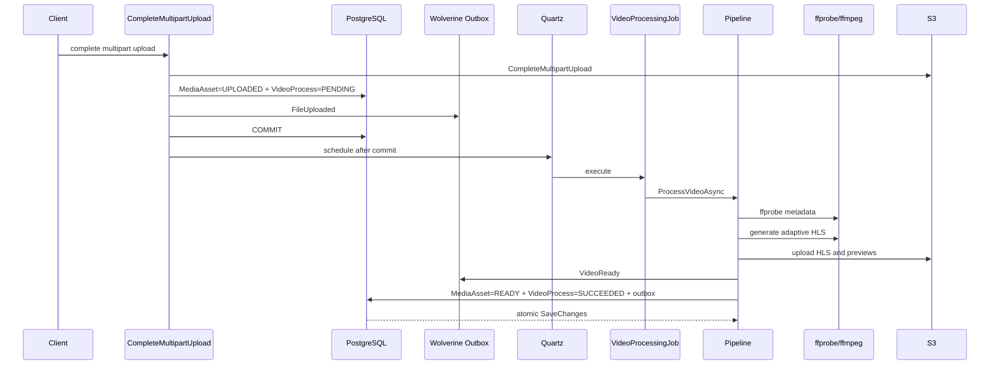

# Надёжная обработка видео в FileService

## Назначение документа

Это конспект изменений вокруг `VideoProcessingJob`, Quartz Scheduler и HLS pipeline. Он объясняет:

- какую задачу решает background processing;
- как было раньше и какие риски существовали;
- как теперь проходит полный flow;
- зачем нужны Quartz, PostgreSQL job store, ffmpeg/ffprobe, Wolverine outbox и OpenTelemetry;
- как самостоятельно проектировать похожие процессы;
- как кратко и технически корректно рассказать об этом на собеседовании.

Документ описывает не только happy path, но и сбои: падение процесса, рестарт контейнера, временная ошибка S3, потерянный trigger, ошибка ffmpeg и повторная доставка события.

## 1. Главная идея

HTTP-запрос не должен ждать транскодирования видео. Оно может занимать минуты, потреблять CPU и завершаться временной ошибкой. Поэтому загрузка и обработка разделены:

1. HTTP-запрос завершает multipart upload.
2. FileService сохраняет бизнес-состояние `VideoProcess`.
3. После commit планируется Quartz job.
4. Job запускает pipeline в фоне.
5. Pipeline вызывает ffprobe, ffmpeg и S3.
6. При временной ошибке job планирует retry.
7. После успеха FileService сохраняет `READY/SUCCEEDED` и `VideoReady` через outbox.

Здесь используются две разные state machine:

- `VideoProcess` — бизнес-состояние обработки;
- Quartz — техническое состояние выполнения по времени.

Quartz отвечает на вопрос: «когда и на каком worker выполнить код?». `VideoProcess` отвечает: «что уже сделано, сколько было попыток и можно ли продолжать?». Нельзя использовать таблицы Quartz как замену доменному состоянию.

## 2. Job и Scheduler: в чём разница

### Scheduler

`VideoProcessingScheduler` создаёт `IJobDetail` и `ITrigger`:

```csharp
var job = JobBuilder.Create<VideoProcessingJob>()
    .WithIdentity(jobKey)
    .UsingJobData("VideoAssetId", videoAssetId.ToString())
    .UsingJobData("AttemptNumber", "1")
    .UsingJobData("CorrelationId", correlationId)
    .StoreDurably()
    .RequestRecovery()
    .Build();

var trigger = TriggerBuilder.Create()
    .WithIdentity($"Trigger_{videoAssetId}", GROUP_NAME)
    .StartAt(startAt ?? DateTimeOffset.UtcNow)
    .WithSimpleSchedule(x => x.WithMisfireHandlingInstructionFireNow())
    .Build();

await scheduler.ScheduleJob(job, trigger, cancellationToken);
```

Scheduler не обрабатывает видео. Он регистрирует описание работы и условие запуска.

### Job

`VideoProcessingJob` — адаптер между Quartz и application/domain logic. Он:

- читает `JobDataMap`;
- создаёт logging scope;
- проверяет `MediaAsset` и `VideoProcess`;
- подготавливает retry или recovery;
- вызывает `IVideoProcessingService`;
- удаляет завершённую job либо создаёт следующий trigger.

Job не должен содержать ffmpeg-команды или правила отдельных pipeline steps. Его ответственность — orchestration одного background execution.

### Trigger

Trigger определяет конкретный момент запуска. Одна durable job может иметь разные triggers: первоначальный, retry и recovery.

Идентификатор вида:

```csharp
$"Retry_{videoAssetId}_{nextAttempt}_{Guid.NewGuid():N}"
```

использует формат GUID `N`: 32 шестнадцатеричных символа без дефисов. Это удобно только для технического имени trigger. Для `CorrelationId` специальный формат не требуется.

## 3. Полный flow от загрузки до готового HLS



Pipeline steps:

1. `INITIALIZE` — создаёт временную рабочую директорию.
2. `EXTRACT_METADATA` — ffprobe определяет duration, width, height и наличие audio stream.
3. `GENERATE_HLS` — ffmpeg создаёт adaptive bitrate HLS.
4. `UPLOAD_HLS` — загружает playlists/segments в S3 и сохраняет master playlist key.
5. `GENERATE_PREVIEW` — создаёт previews/sprite sheet.
6. `CLEANUP` — удаляет raw object и локальные временные файлы.

## 4. Главное исправление: schedule только после commit

### Было

Job мог быть запланирован до commit транзакции загрузки. Быстрый Quartz worker мог начать выполнение и не найти `VideoProcess` или увидеть старый `MediaAsset` status.

Это race condition:

```text
Transaction: INSERT VideoProcess (ещё не committed)
Quartz:      START Job
Job:         SELECT VideoProcess -> not found
Transaction: COMMIT
```

### Стало

Сначала создаётся `PENDING` process и выполняется commit. Только затем вызывается scheduler:

```csharp
var finalCommitResult = transactionScope.Commit();
if (finalCommitResult.IsFailure)
    return finalCommitResult.Error.ToFailure();

transactionCommitted = true;

if (videoAssetIdToSchedule.HasValue)
{
    await _videoProcessingScheduler.ScheduleProcessingAsync(
        videoAssetIdToSchedule.Value,
        correlationId,
        cancellationToken: cancellationToken);
}
```

Теперь job никогда не стартует раньше видимости бизнес-данных.

Между DB commit и `ScheduleProcessingAsync` всё ещё существует маленькое окно: процесс может упасть после commit, но до Quartz call. Его закрывает reconciliation service, который находит `PENDING` process без trigger и восстанавливает scheduling.

Это стандартный подход: сначала durable intent в своей БД, затем best-effort dispatch, затем reconciliation.

## 5. Persistent Quartz store

### Было

RAM store хранил jobs/triggers только в памяти. После рестарта контейнера очередь исчезала.

### Стало

Quartz использует PostgreSQL tables в schema `quartz`:

```csharp
q.UsePersistentStore(store =>
{
    store.PerformSchemaValidation = true;
    store.UseProperties = true;
    store.UsePostgres(postgres =>
    {
        postgres.ConnectionString = connectionString;
        postgres.TablePrefix = videoOptions.QuartzTablePrefix;
    });
    store.UseSystemTextJsonSerializer();
    store.UseClustering(...);
});
```

Зачем отдельные настройки:

- `PerformSchemaValidation` — fail fast при неправильной schema;
- `UseProperties` — `JobDataMap` хранит простые string values и не зависит от сериализации произвольных CLR objects;
- `UseSystemTextJsonSerializer` — поддерживаемый serializer Quartz;
- `UseClustering` — несколько FileService instances координируют работу через одну БД;
- `TablePrefix = "quartz.qrtz_"` — таблицы находятся в отдельной PostgreSQL schema.

Migration `20260628090000_AddQuartzPersistentStore` соответствует PostgreSQL schema Quartz 3.16.1.

Persistent store значительно повышает надёжность, но не отменяет reconciliation. Возможны бизнес-записи без job из-за сбоя между двумя системами.

## 6. Startup/periodic recovery

`VideoProcessingRecoveryService` периодически читает recoverable processes:

```csharp
process.Status == PENDING
|| process.Status == RUNNING
|| (process.Status == FAILED
    && !process.IsCriticalError
    && process.RetryCount < process.MaxRetries)
```

Для каждого кандидата scheduler проверяет:

- существует ли job;
- есть ли у job trigger;
- выполняется ли job прямо сейчас.

Если job уже scheduled/running, создаётся no-op. Если durable job осталась без trigger, создаётся recovery trigger. Если job отсутствует, она создаётся заново.

Операция идемпотентна: повторный recovery scan не должен создавать параллельную обработку одного video asset.

## 7. Retry state machine

### Семантика счётчика

`MaxRetries = 3` означает три повторных запуска после первоначальной попытки.

- `PlannedRetry` сохраняет `NextRetryAt`, но не увеличивает счётчик;
- `PrepareForRetry` вызывается, когда повтор действительно стартует, и увеличивает `RetryCount`.

```csharp
public UnitResult<Error> PlannedRetry(DateTime nextRetryAt)
{
    if (RetryCount >= MaxRetries)
        return Error.Validation("invalid.retry.count", "Max retries exceeded");

    NextRetryAt = nextRetryAt;
    return UnitResult.Success<Error>();
}

public UnitResult<Error> PrepareForRetry()
{
    if (!CanRetry())
        return Error.Validation("retry.not.allowed", "Cannot retry this process");

    foreach (VideoProcessStep step in _steps)
        step.Reset();

    RetryCount++;
    NextRetryAt = null;
    Status = VideoProcessStatus.PENDING;
    return UnitResult.Success<Error>();
}
```

### Почему retry начинает pipeline с первого шага

`ProcessingContext` содержит ephemeral data:

- temp directory;
- HLS output directory;
- presigned URL;
- локальные preview/HLS files.

Эти данные не переживают новый Quartz execution или рестарт контейнера. Продолжить с `UPLOAD_HLS` после рестарта нельзя: локальных segments уже нет.

Поэтому retry сбрасывает все steps и начинает с `INITIALIZE`. Это менее эффективно, зато корректно. Настоящий resume с checkpoint потребовал бы хранить промежуточные артефакты в durable storage и персистить их references.

### Backoff

`ConfiguredVideoProcessingPolicy` вычисляет capped exponential backoff:

```text
RetryDelaySeconds * 1, 2, 4, 8, 8, ...
```

Policy находится в application infrastructure, потому что base delay — конфигурация deployment. Domain хранит только `MaxRetries`, `RetryCount` и правила допустимости перехода.

## 8. Классификация ошибок

Не все ошибки следует повторять.

Permanent examples:

- invalid ffprobe output;
- validation/domain invariant violation;
- отсутствующий pipeline handler;
- invalid media status;
- некорректная конфигурация work directory.

Transient examples:

- временная ошибка S3/network;
- недоступность внешнего transport;
- unexpected infrastructure exception;
- потерянное соединение с PostgreSQL.

`ProcessingErrorClassifier` преобразует `Error` в решение `IsCritical`. Pipeline сохраняет это решение в `VideoProcess`. Job не должен пытаться retry для permanent error.

В большом production-проекте классификацию обычно делают typed exceptions/error categories, а также отдельно задают retry policy для S3, database, RabbitMQ и ffmpeg. Текущий classifier — компактная версия этого подхода.

## 9. Ограничение параллельности

ffmpeg — CPU/RAM intensive process. Неограниченное число jobs способно уничтожить latency всего сервиса.

```csharp
q.UseDefaultThreadPool(options =>
    options.MaxConcurrency = videoOptions.MaxConcurrentJobs);
```

Дополнительно:

```csharp
[DisallowConcurrentExecution]
public class VideoProcessingJob : IJob
```

Это две разные гарантии:

- `MaxConcurrency` ограничивает общее число одновременно работающих Quartz jobs;
- `DisallowConcurrentExecution` запрещает одновременно выполнять один и тот же `JobKey`.

В Kubernetes дополнительно применяют CPU/memory limits, отдельную worker deployment и autoscaling по queue depth.

## 10. CorrelationId и logging scope

HTTP middleware добавляет `CorrelationId` в Serilog `LogContext`. Но request scope заканчивается после HTTP-response. Background job может начаться позже и на другом instance.

Поэтому correlation id проходит durable chain:

```text
X-Correlation-Id / TraceIdentifier
    -> VideoProcess.CorrelationId
    -> Quartz JobDataMap
    -> ILogger.BeginScope
    -> retries/recovery
    -> VideoReady
```

В job используется обычный `ILogger<T>.BeginScope`:

```csharp
using IDisposable? logScope = _logger.BeginScope(
    new Dictionary<string, object>(StringComparer.Ordinal)
    {
        ["CorrelationId"] = correlationId,
        ["VideoAssetId"] = videoAssetId,
    });
```

Все логи внутри scope автоматически получают эти properties.

Не путать:

- `IServiceScopeFactory` создаёт DI scope и scoped services/DbContext;
- `ILogger.BeginScope` обогащает логи context properties;
- `Activity` создаёт distributed trace span.

Исправление SharedService middleware:

```csharp
private const string CORRELATION_ID = "CorrelationId";

public async Task Invoke(HttpContext httpContext)
{
    ...
    using (LogContext.PushProperty(CORRELATION_ID, correlationId))
    {
        await next(httpContext);
    }
}
```

`await` удерживает `LogContext` до завершения downstream pipeline. Имя `CorrelationId` должно совпадать с queries/dashboards.

## 11. Metrics, traces и logs

`VideoProcessingTelemetry` содержит `Meter` и `ActivitySource`.

Metrics:

- `video_processing.active_jobs`;
- completed jobs;
- failed attempts;
- retries;
- total processing duration;
- step duration.

Traces:

- span всего video processing;
- consumer span Quartz job;
- span каждого pipeline step.

Logs:

- диагностические сообщения и exceptions;
- `CorrelationId`, `VideoAssetId`, step/attempt.

Почему `CorrelationId` не добавлен как metric label: каждый id уникален. Это создаёт unbounded cardinality и перегружает Prometheus. IDs допустимы в logs/traces, а metric labels должны иметь ограниченный набор значений, например `step` и `status`.

Локальная строка `status = "succeeded"/"failed"` в step telemetry — не domain status и не замена `Error`. Это label для histogram и trace status.

### Structured ErrorCode: почему `Failure` его не добавляет

`Error` содержит `Code`, `Message`, `Type` и `InvalidField`, но `Failure` является только коллекцией ошибок:

```csharp
public class Failure : IEnumerable<Error>
{
    private readonly List<Error> _errors;

    public Failure(IEnumerable<Error> errors)
    {
        _errors = [.. errors];
    }
}
```

`Error.ToFailure()` также ничего не пишет в лог и не добавляет Serilog properties:

```csharp
public Failure ToFailure() => new([this]);
```

HTTP response сериализует поля `Error`, но это отдельный механизм, не связанный с `ILogger`. Если передать весь record как `{Error}`, он будет представлен одной строкой, а `Code` не станет отдельным индексируемым полем в Seq/Loki:

```csharp
// Было: Error превращается в одну строку вместе с Message/Type/InvalidField.
logger.LogError("Video processing failed: {Error}", error);

// Стало: стабильное structured property для поиска и dashboard.
logger.LogError(
    "Video processing failed for video asset {VideoAssetId}. Error code: {ErrorCode}",
    videoAssetId,
    error.Code);
```

Правило проекта:

- `ErrorCode` логируется на failure boundary;
- `ErrorType` добавляется только если по нему действительно строится фильтрация;
- `ErrorMessage` не повторяется на каждом слое и не логируется для infrastructure errors без проверки;
- полный exception сохраняется только для неожиданной ошибки, когда stack trace нужен для диагностики.

Пример поиска:

```logql
{service_name="FileService"} | json | ErrorCode="hls.processing.failed"
```

## 12. Безопасное логирование ffmpeg

Presigned URL содержит временную подпись и credentials-like query parameters. Нельзя логировать полную ffmpeg command line или stderr без фильтрации.

Теперь runner:

- логирует executable, но не arguments;
- не логирует stderr построчно;
- при ошибке пишет один aggregate stderr log;
- редактирует URL в stderr;
- ограничивает logged stderr первыми 4096 символами;
- regex имеет timeout против pathological input;
- при cancellation завершает всё process tree.

```csharp
private const int MAX_LOGGED_STDERR_LENGTH = 4096;

[GeneratedRegex(@"https?://\S+", RegexOptions.IgnoreCase, matchTimeoutMilliseconds: 1000)]
private static partial Regex UrlPattern();

private static string RedactUrls(string value) =>
    UrlPattern().Replace(value, "[REDACTED_URL]");

private static string SanitizeProcessOutput(string value)
{
    string sanitizedValue = RedactUrls(value);
    return sanitizedValue.Length <= MAX_LOGGED_STDERR_LENGTH
        ? sanitizedValue
        : $"{sanitizedValue[..MAX_LOGGED_STDERR_LENGTH]} [TRUNCATED]";
}
```

До исправления один и тот же stderr логировался дважды: каждая строка на `Debug`, затем весь accumulated output на `Error`. Для ffmpeg это может создать тысячи событий. Теперь callback только собирает stderr, а итоговая ошибка записывается один раз:

```csharp
logger.LogError(
    "External process {FileName} failed with exit code {ExitCode}. Stderr: {StandardError}",
    processCommand.ExecutableFile,
    result.ExitCode,
    SanitizeProcessOutput(result.StandardError));
```

Старт каждого внешнего процесса переведён с `Information` на `Debug`, потому что генерация preview может запускать ffmpeg несколько раз за одну job.

В production лучше передавать input через short-lived URL, ограничивать доступ к logs и не включать command arguments даже на Debug level.

### DbUpdateConcurrencyException и огромный EF dump

В SharedService подключён `Serilog.Exceptions.WithExceptionDetails()`. Для обычных exceptions он полезен, но `DbUpdateConcurrencyException` содержит коллекцию `Entries`. Enricher рекурсивно раскрыл `EntityEntry`, `CurrentValues`, `OriginalValues` и `DebugView`. В результате один log event занимал десятки тысяч символов и содержал domain data, включая представление `RawKey`.

Было:

```csharp
catch (DbUpdateException ex)
{
    logger.LogError(ex, "Concurrency conflict during transaction");
}
```

Стало: ожидаемый concurrency conflict логируется без передачи всего exception graph:

```csharp
catch (DbUpdateConcurrencyException ex)
{
    logger.LogWarning(
        "Database concurrency conflict while saving changes. " +
        "Conflicting entries: {ConflictingEntryCount}",
        ex.Entries.Count);

    return Error.Failure("database", "Concurrency conflict");
}
```

Обычный `DbUpdateException` также не destructure-ится целиком; сохраняется только безопасный тип:

```csharp
logger.LogError(
    "Database update failed while saving changes. Exception type: {ExceptionType}",
    ex.GetType().Name);
```

Глобальный exception enricher не удалён, потому что это изменение shared logging policy для всех сервисов. Вместо этого ожидаемый EF exception обрабатывается локально и безопасно.

### Уменьшение framework noise

Runtime-проверка показала несколько дублирующихся потоков:

- ASP.NET `Request starting/finished` дублировал Serilog request logging;
- Quartz и Wolverine писали внутренний startup lifecycle на `Information`;
- producer-only FileService получал ожидаемый warning `Wolverine found no handlers`;
- Docker config включал `Default=Debug`, EF query Debug и HTTP client Information;
- `WithExceptionDetails` подключался повторно через JSON, хотя уже добавлялся программно.

В `appsettings.Development.json`, `appsettings.Docker.json` и `appsettings.Testing.json` применены overrides:

```json
{
  "Default": "Information",
  "Override": {
    "Microsoft": "Warning",
    "Microsoft.AspNetCore": "Warning",
    "Microsoft.AspNetCore.Hosting": "Warning",
    "Microsoft.EntityFrameworkCore": "Warning",
    "Microsoft.EntityFrameworkCore.Database.Command": "Error",
    "Quartz": "Warning",
    "Wolverine": "Warning",
    "Wolverine.Configuration.HandlerDiscovery": "Error",
    "Amazon": "Warning",
    "AWSSDK": "Warning",
    "System.Net.Http.HttpClient": "Warning"
  }
}
```

В результате остаётся один HTTP summary от `Serilog.AspNetCore.RequestLoggingMiddleware`, application workflow logs и реальные warning/error events. SQL queries, transport startup и внешние HTTP URLs по умолчанию не попадают в Information logs.

Дополнительно понижены или объединены дубли:

- handler start messages переведены на `Debug`, потому что pipeline уже пишет начало step;
- scheduling success остаётся только в `VideoProcessingScheduler`;
- transaction commit переведён на `Debug`;
- cleanup с нулём удалённых директорий пишется на `Debug`;
- recovery summary пишется на `Debug`, чтобы не повторяться каждую минуту;
- полный multipart integration test ждёт `READY/SUCCEEDED`, поэтому test fixture больше не очищает БД во время работающей Quartz job и не создаёт ложные concurrency errors.

## 13. ffmpeg/ffprobe внутри Docker

Host-local путь `D:\...\ffmpeg.exe` не существует внутри Linux container. Runtime image обязан содержать binaries:

```dockerfile
RUN apt-get -o Acquire::Retries=3 update \
    && apt-get -o Acquire::Retries=3 install -y --no-install-recommends ffmpeg \
    && rm -rf /var/lib/apt/lists/*
```

В Docker config используются команды `ffmpeg` и `ffprobe`, найденные через `PATH`. `Acquire::Retries` уменьшает случайные CI failures при временной ошибке Debian mirror.

Для строгой reproducibility в production можно использовать отдельный pinned base image с конкретной версией ffmpeg.

## 14. Adaptive HLS и видео без audio

ffprobe теперь читает все streams:

```text
-show_entries stream=codec_type,width,height
-show_entries format=duration
```

`VideoMetadata` хранит `Width`, `Height`, `Duration`, `HasAudio`.

Правило renditions:

- source 1080p -> 360p, 720p, 1080p;
- source 720p -> 360p, 720p;
- source 480p -> 360p;
- source ниже 360p -> исходная высота без upscale.

```csharp
Rendition[] renditions = Renditions
    .Where(rendition => rendition.Height <= sourceHeight)
    .ToArray();
```

Audio mappings создаются только при `HasAudio=true`:

```csharp
return hasAudio
    ? string.Concat(Enumerable.Range(0, renditionCount).Select(index =>
        $"-map 0:a:0 -c:a:{index} aac -b:a:{index} 96k -ac 2 "))
    : string.Empty;
```

Это предотвращает две проблемы:

- бессмысленный upscale маленького видео до 1080p;
- падение ffmpeg на обязательном `[0:a]` для ролика без audio stream.

## 15. VideoReady и transactional outbox

`FileUploaded` означает, что original object принят. Это не означает, что HLS готов.

`VideoReady` содержит:

```csharp
public sealed record VideoReady(
    Guid AssetId,
    Guid TargetEntityId,
    string TargetEntityType,
    string HlsKey,
    string CorrelationId,
    DateTimeOffset ReadyAtUtc);
```

Routing key:

```text
file.video.ready.{targetEntityType}
```

Событие публикуется через Wolverine durable outbox до финального `SaveChanges`. Затем одним EF save сохраняются:

- `MediaAsset = READY`;
- `VideoProcess = SUCCEEDED`;
- outgoing `VideoReady` envelope.

Это решает dual-write problem: нельзя отдельно сделать DB commit, затем RabbitMQ publish и надеяться, что процесс не упадёт между ними.

Consumer обязан быть идемпотентным, потому что outbox/inbox обычно обеспечивает at-least-once delivery, а не exactly-once execution.

Контракт находится в `FileService.Contracts`, потому что FileService владеет событием. Для подключения нового consumer нужно опубликовать package `IstredDev.FileService.Contracts 0.0.6`.

## 16. Cleanup orphan temp directories

Обычный `CLEANUP` step удаляет рабочую директорию на happy path. После crash этот step может не выполниться.

Отдельный `TempDirectoryCleanupJob`:

- запускается Quartz по интервалу;
- имеет `[DisallowConcurrentExecution]`;
- ищет только `video-processing*` внутри `Path.GetTempPath()`;
- удаляет только директории старше TTL;
- не завершает весь job из-за одной недоступной директории.

Почему нужен строгий prefix/root check: background cleanup с recursive delete — опасная операция. Нельзя строить путь из непроверенного input или удалять произвольную директорию.

## 17. Валидация конфигурации

Вместо DataAnnotations используются `IValidateOptions<T>`:

```csharp
services.AddSingleton<IValidateOptions<VideoProcessingOptions>,
    VideoProcessingOptionsValidator>();

services.AddOptions<VideoProcessingOptions>()
    .Bind(configuration.GetSection(VideoProcessingOptions.SECTION_NAME))
    .ValidateOnStart();
```

Преимущества explicit validator:

- cross-field rules (`MinPreviewCount <= MaxPreviewCount`);
- conditional rules (`UsePersistentStore` требует table prefix);
- options class не зависит от validation attributes;
- все сообщения собраны в одном месте;
- service падает на старте, а не через несколько минут внутри job.

DataAnnotations тоже нормальная практика для простых DTO/options. Здесь explicit validator удобнее из-за conditional/cross-field constraints.

Ключевые options:

| Option | Назначение |
|---|---|
| `MaxRetries` | число повторных запусков |
| `RetryDelaySeconds` | base delay exponential backoff |
| `MaxConcurrentJobs` | общий лимит ffmpeg jobs |
| `UsePersistentStore` | PostgreSQL или RAM Quartz store |
| `UseQuartzClustering` | координация нескольких instances |
| `RecoveryScanIntervalSeconds` | период reconciliation |
| `TempDirectoryMaxAgeHours` | TTL orphan temp directory |
| `TempCleanupIntervalMinutes` | период cleanup job |
| `UploadDegreeOfParallelism` | параллельность загрузки HLS files |

## 18. Нормальная ли это практика

Да. Основные решения широко применяются в production systems:

- background job вместо долгого HTTP request;
- durable scheduler store;
- domain state отдельно от scheduler state;
- schedule-after-commit;
- reconciliation для закрытия dual-write window;
- retry только transient errors;
- exponential backoff;
- idempotent job/consumer;
- transactional outbox;
- bounded concurrency;
- correlation через async boundary;
- metrics без high-cardinality IDs;
- fail-fast options validation;
- отдельная уборка orphan resources.

Что в больших системах может быть иначе:

- вместо Quartz используют Hangfire, MassTransit scheduler, Temporal, AWS Step Functions, Kubernetes Jobs или message broker consumers;
- video workers выделяют в отдельный service/deployment;
- промежуточные artifacts сохраняют в object storage для checkpoint/resume;
- retries и dead-letter queues настраивают отдельно для каждого dependency;
- CPU/GPU workers планируются отдельными node pools.

Принципы остаются теми же, меняются инструменты.

## 19. Failure scenarios

| Сбой | Что происходит |
|---|---|
| API упал до DB commit | upload transaction rollback, job не создаётся |
| API упал после commit до schedule | recovery service найдёт `PENDING` process |
| FileService рестартовал до trigger | persistent Quartz восстановит trigger |
| Quartz job осталась без trigger | reconciliation создаст recovery trigger |
| Worker упал во время step | `RUNNING` process будет восстановлен как retry и pipeline начнётся с `INITIALIZE` |
| S3 временно недоступен | transient failure, retry с backoff |
| ffprobe вернул invalid metadata | permanent failure, retry не выполняется |
| видео без audio | ffmpeg command не содержит audio mappings |
| source 720p | 1080p rendition не генерируется |
| RabbitMQ временно недоступен | Wolverine outbox сохраняет envelope в PostgreSQL и доставляет позже |
| cleanup step не выполнился | Quartz cleanup удалит stale temp directory по TTL |

## 20. Как проектировать подобный flow самостоятельно

1. Определить durable business state (`PENDING/RUNNING/FAILED/SUCCEEDED`).
2. Отделить business state от queue/scheduler state.
3. Записать transaction boundaries и найти dual-write windows.
4. Сделать job idempotent: повторный запуск не ломает данные.
5. Разделить transient и permanent errors.
6. Явно определить семантику retry counter.
7. Выбрать backoff и максимальное число попыток.
8. Проверить, какие данные ephemeral и переживают ли они рестарт.
9. Добавить recovery/reconciliation.
10. Ограничить concurrency тяжёлых операций.
11. Добавить correlation, logs, metrics и traces.
12. Не использовать unique IDs как metric labels.
13. Добавить cleanup для внешних/локальных ресурсов.
14. Покрыть domain transitions unit tests.
15. Проверить happy path и migrations integration tests.
16. Проверить container runtime dependencies.

## 21. Как рассказать на собеседовании

Короткая версия:

> Я вынес длительное HLS-транскодирование из HTTP flow в Quartz jobs. Исправил race condition: сначала в одной транзакции сохраняется uploaded asset и pending VideoProcess, после commit создаётся job. Quartz использует PostgreSQL persistent store и clustering, а reconciliation восстанавливает потерянные triggers. Retry основан на domain state, классификации transient/permanent errors и exponential backoff. Поскольку локальный ProcessingContext не переживает новый execution, retry идемпотентно запускает pipeline с начала. Я ограничил ffmpeg concurrency, добавил correlation через JobDataMap, OpenTelemetry metrics/traces без high-cardinality labels, transactional `VideoReady` outbox, adaptive HLS без upscale и поддержку видео без audio.

Если спросят «зачем persistent Quartz вместе с recovery service»:

> Persistent Quartz сохраняет уже созданные jobs/triggers при рестарте. Recovery service закрывает другое окно: бизнес-транзакция могла commit, а scheduler call ещё не выполниться. Эти механизмы дополняют друг друга.

Если спросят «почему retry с начала»:

> Pipeline использует локальные временные файлы и presigned URL, которые не являются durable checkpoint. Продолжение с середины после рестарта было бы некорректно. Для настоящего resume я бы сохранял intermediate artifacts в object storage и их references в БД.

## 22. Проверки

На момент реализации выполнено:

- FileService unit tests: `49/49`;
- FileService integration tests после финального state-machine уточнения: `44/44`;
- FileService, DirectoryService, SharedService builds: `0 warnings / 0 errors`;
- runtime log audit выполнен через full multipart/HLS integration flow;
- в runtime logs подтверждены `CorrelationId`, `VideoAssetId`, step/progress и elapsed time;
- presigned URL, ffmpeg arguments и EF entity dumps в runtime logs отсутствуют;
- Docker Compose config: valid;
- Docker restore переведён на GitLab Package Registry с BuildKit secrets;
- полный Docker build выполнен успешно;
- установка ffmpeg использует HTTPS, retries и BuildKit cache для защиты от нестабильности Debian mirror.

## 23. Ручные действия перед merge/deploy

SharedService packages уже обновлены в корневом `Directory.Packages.props`:

```xml
<PackageVersion Include="istreddev.framework" Version="0.0.14" />
<PackageVersion Include="istreddev.sharedkernel" Version="0.0.7" />
```

Quartz serializer перенесён в central package management:

```xml
<PackageVersion Include="Quartz.Serialization.SystemTextJson" Version="3.16.1" />
```

После публикации `IstredDev.FileService.Contracts 0.0.6` consumer может подключить `VideoReady`. До появления consumer менять DirectoryService package необязательно.

Для повторного Docker smoke test передайте GitLab Deploy Token через `NUGET_USERNAME` и `NUGET_PASSWORD`:

```powershell
docker compose -f ..\docker-compose-dev.yml up -d --build
docker compose -f ..\docker-compose-dev.yml ps
docker logs file-service --tail 100
docker exec file-service ffmpeg -version
docker exec file-service ffprobe -version
```

## 24. Основные файлы

- `FileService.Core/Features/CompleteMultipartUploadEndpoint.cs` — transaction boundary и schedule-after-commit.
- `FileService.Domain/MediaProcessing/VideoProcess.cs` — domain state machine и retry rules.
- `FileService.VideoProcessing/Quartz/VideoProcessingScheduler.cs` — jobs/triggers.
- `FileService.VideoProcessing/Quartz/VideoProcessingJob.cs` — orchestration attempt/retry/recovery.
- `FileService.VideoProcessing/Quartz/VideoProcessingRecoveryService.cs` — reconciliation.
- `FileService.VideoProcessing/Pipeline/ProcessingPipeline.cs` — ordered steps и finalization/outbox.
- `FileService.VideoProcessing/FfmpegProcess/FfmpegProcessRunner.cs` — ffprobe/ffmpeg commands.
- `FileService.VideoProcessing/VideoProcessingTelemetry.cs` — metrics/traces.
- `FileService.VideoProcessing/ProcessRunner/DataProcessRunner.cs` — safe process execution/logging.
- `FileService.VideoProcessing/Quartz/TempDirectoryCleanupJob.cs` — orphan cleanup.
- `FileService.Infrastructure.Postgres/Database/TransactionManager.cs` — безопасное логирование EF failures.
- `FileService.Web/appsettings.*.json` — log-level overrides для framework dependencies.
- `FileService.Contracts/Messaging/Events/VideoReady.cs` — integration event contract.
- `FileService.Infrastructure.Postgres/Migrations/*Quartz*` — persistent scheduler schema.
