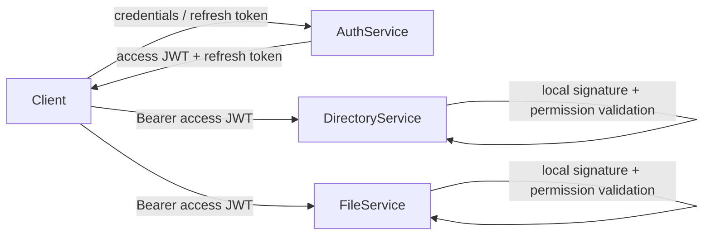
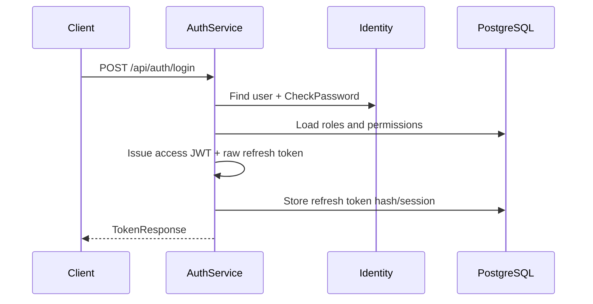
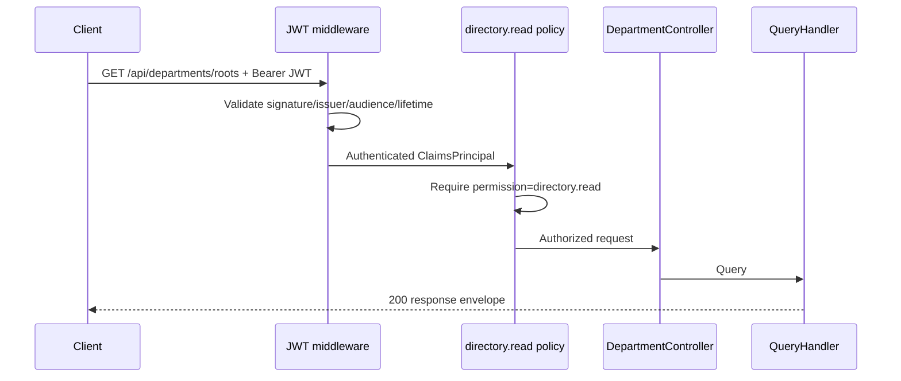
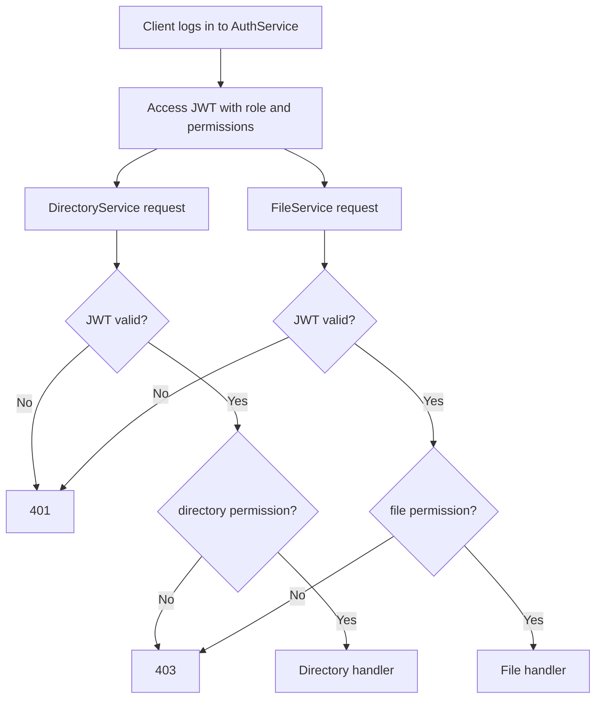

# Authentication, Roles And Permissions Flows

## Назначение

Документ описывает текущую реализацию authentication и authorization в `AuthService`, `DirectoryService` и `FileService`. Это состояние MVP после подключения локальной JWT validation и permission policies в resource services.

Источники: knowledge graph Graphify использован для поиска endpoint/handler communities и зависимостей; окончательные routes, policies и security rules сверены по актуальным исходным файлам. Snapshot Graphify может отставать от последних коммитов, поэтому он не используется как единственный источник точных деталей.

## Границы Сервисов

- `AuthService` владеет users, credentials, roles, permissions, access JWT, refresh sessions, invites, password reset и auth audit events.
- `DirectoryService` владеет departments, locations, positions и company hierarchy.
- `FileService` владеет media metadata, multipart uploads, storage URLs, delete и video processing.
- Resource services проверяют access JWT локально и не вызывают AuthService на каждый request.
- Детальные business boundaries, например доступ к конкретному department, не должны храниться в JWT как большие access trees.



## JWT И Permission Pipeline

Access JWT содержит как минимум identity claims и authorization context: user id (`sub`), current company, roles и повторяющиеся `permission` claims.

Каждый resource service проверяет:

1. подпись symmetric signing key;
2. `issuer`;
3. `audience`;
4. `exp`/`nbf` с `ClockSkew = 30 seconds`;
5. требуемый `permission` claim.

Результаты:

- JWT отсутствует, malformed, expired или имеет неверную подпись/issuer/audience: `401 Unauthorized`;
- JWT валиден, но permission отсутствует: `403 Forbidden`;
- JWT и permission валидны: запускается endpoint/controller, затем application handler.

Signing key не хранится в committed `appsettings`. Текущий MVP использует общий symmetric key; целевое усиление — private/public key signing, где private key остаётся только в AuthService.

## Roles И Permissions

Endpoint проверяет permission, а не название роли. AuthService преобразует роль в набор permissions и помещает их в access JWT.

```text
User -> Role -> RolePermissions -> permission claims -> Policy -> Endpoint
```

| Role | Permissions |
|---|---|
| `SystemAdmin` | `users.manage`, `directory.read`, `directory.manage`, `files.read`, `files.upload`, `files.delete`, `videos.read`, `videos.upload` |
| `CompanyAdmin` | `users.manage`, `directory.read`, `directory.manage`, `files.read`, `files.upload`, `files.delete`, `videos.read`, `videos.upload` |
| `Operator` | `directory.read`, `files.read`, `files.upload`, `files.delete`, `videos.read`, `videos.upload` |
| `Technician` | `directory.read`, `files.read`, `videos.read`, `videos.upload` |
| `Viewer` | `directory.read`, `files.read`, `videos.read` |

`videos.read` и `videos.upload` зарезервированы для video-specific routes. Текущие generic multipart routes используют file permissions.

После изменения роли уже выданный access JWT сохраняет старые claims до expiration. Новый permission set появляется после следующего login/refresh. Поэтому access JWT короткоживущий, а deactivation дополнительно отзывает refresh sessions.

## AuthService: Authentication И Token Lifecycle

### Login

`POST /api/auth/login`

1. Endpoint валидирует request и передаёт command в `LoginHandler`.
2. `UserManager` находит Identity user и проверяет password.
3. Missing user, wrong password и inactive user получают одинаковую public auth failure без user enumeration.
4. AuthService загружает roles и role permissions.
5. `ITokenService` выпускает короткоживущий access JWT.
6. Создаётся cryptographically random refresh token; в БД сохраняется только hash.
7. Refresh session и связанные изменения сохраняются в явной transaction.
8. Client получает access token и raw refresh token.



### Refresh Rotation

`POST /api/auth/refresh`

1. Client передаёт access token и raw refresh token.
2. AuthService hash-ит raw refresh token и ищет session record.
3. Unknown, expired или invalid token возвращает security-safe failure.
4. Если token уже revoked/replaced, это reuse detection: AuthService отзывает все активные refresh sessions пользователя.
5. Для активного token создаются новый access JWT и replacement refresh token.
6. Старый refresh token помечается revoked и связывается с replacement id.
7. Rotation сохраняется атомарно.

Raw refresh token никогда не хранится и не логируется.

### Client Auto-Refresh

Resource service не обновляет JWT автоматически. При `401` client:

1. выполняет одну попытку `POST /api/auth/refresh`;
2. сохраняет новую пару tokens;
3. повторяет исходный request;
4. при неуспешном refresh очищает session и показывает login.

Параллельные `401` должны объединяться в один refresh operation, чтобы не вызвать reuse detection несколькими одновременными запросами.

### Logout И Session Revocation

| Endpoint | Authentication | Flow |
|---|---|---|
| `POST /api/auth/logout` | refresh token является доказательством session | Hash lookup, idempotent revoke одной session, audit event |
| `GET /api/auth/sessions` | valid access JWT | Список активных sessions текущего user без token/hash |
| `POST /api/auth/revoke-session` | valid access JWT | Revoke session только по `(sessionId, currentUserId)` |
| `POST /api/auth/revoke-all-sessions` | valid access JWT | Revoke всех active sessions текущего user |

Unknown/already-revoked session cases намеренно идемпотентны там, где раскрытие состояния ухудшает security.

## AuthService: Invite И Password Recovery

### Invite User

`POST /api/users/invite` требует `users.manage`.

1. Actor определяется из `sub` claim.
2. Проверяются role/company boundaries: `CompanyAdmin` ограничен своей company; `SystemAdmin` имеет global scope.
3. Создаётся inactive Identity user без password.
4. Назначается выбранная role.
5. Создаётся one-time invite token на 3 дня; в БД хранится hash.
6. User, role, invite token и audit event сохраняются transactionally.
7. После commit email sender отправляет invite link.

`POST /api/users/{userId}/resend-invite` отзывает active pending invites и выпускает новую ссылку только для inactive user без password.

### Accept Invite

`POST /api/auth/accept-invite`

1. Raw invite token hash-ится и ищется в БД.
2. Unknown, expired, revoked или used token имеет единый public failure.
3. Identity устанавливает password.
4. User активируется, invite помечается accepted.
5. Изменения и audit event сохраняются transactionally.

### Password Reset

| Endpoint | Flow |
|---|---|
| `POST /api/auth/request-password-reset` | Всегда security-safe `200` для unknown/inactive/no-password user; для valid user создаётся hash-only token на 1 час и отправляется link |
| `POST /api/auth/reset-password` | Проверка token hash/state, замена Identity password, mark used, revoke active refresh sessions, audit event |

Invite и password-reset tokens — разные lifecycle и таблицы. Raw tokens не сохраняются и не логируются.

## AuthService: User Management

Все admin routes требуют `users.manage`.

| Endpoint | Назначение | Основные boundaries |
|---|---|---|
| `GET /api/users` | Paged user directory | CompanyAdmin видит только свою company |
| `GET /api/users/{userId}` | Safe user details | Без password/security/token fields |
| `PATCH /api/users/{userId}/profile` | Изменение `displayName` | Не смешивается с role/status/password |
| `PATCH /api/users/{userId}/change-status` | Activate/deactivate | Self-deactivation запрещена; deactivate отзывает refresh sessions |
| `PATCH /api/users/{userId}/change-role` | Замена role | Self-role-change запрещён; CompanyAdmin не назначает SystemAdmin |
| `GET /api/users/{userId}/sessions` | Admin session view | Self-flow использует `/api/auth/sessions` |
| `POST /api/users/{userId}/revoke-sessions` | Admin revoke | Self-flow использует `/api/auth/revoke-all-sessions` |

Commands используют Identity/EF Core и explicit transactions. Read-heavy queries используют Dapper. Security-sensitive изменения записывают safe audit events без credentials, raw tokens или links.

## DirectoryService Authorization

DirectoryService использует MVC `[Authorize(Policy = ...)]` и локально валидирует AuthService JWT.

| Policy | Routes/operations |
|---|---|
| `directory.read` | Read department roots, children, top positions; read locations |
| `directory.manage` | Create department/location/position; move department; update department locations/video; soft delete |

Public prefixes:

- `/api/departments`;
- `/api/locations`;
- `/api/positions`.

### Read Department Flow



Roles не проверяются в controller. Изменение role composition в AuthService не требует переписывать DirectoryService policies.

## FileService Authorization

FileService использует Minimal API `.RequireAuthorization(policy)` и локально валидирует AuthService JWT.

| Policy | Endpoints |
|---|---|
| `files.read` | `POST /files/{id}`, `POST /files/batch`, `POST /files/download/url` |
| `files.upload` | `POST /files/multipart/start`, `/files/chunk-upload/url`, `/files/multipart/end`, `/files/multipart/cancel` |
| `files.delete` | `DELETE /files/{id}` |

`files.delete` отделён от upload как destructive capability. Его получают `SystemAdmin`, `CompanyAdmin`, `Operator`.

### Multipart Upload Flow

1. Client получает access JWT с `files.upload`.
2. Start endpoint создаёт media asset и multipart upload, возвращает upload id/URLs.
3. Chunk URL endpoint выдаёт URL для конкретной части.
4. Client загружает chunks непосредственно в storage.
5. Complete endpoint завершает multipart upload, сохраняет state и integration event.
6. Для video создаётся processing state и после commit планируется Quartz job.
7. Cancel endpoint abort-ит storage upload и удаляет незавершённый asset.

Каждый HTTP endpoint проверяет `files.upload` до запуска handler.

### Internal Existence Check

`POST /files/{mediaAssetId}/exists` вызывается DirectoryService и пока не защищён user permission policy. Назначать ему `files.read` недостаточно: это internal service-to-service boundary. Следующий security design должен определить service identity, credential/token issuing, audience и rotation; до этого endpoint остаётся явно отмеченным исключением.

## Межсервисный Request Flow



## Security Invariants

- Не логировать passwords, password hashes, JWT, refresh/invite/reset tokens, signing keys или presigned URLs.
- Raw refresh/invite/reset tokens не хранить в БД; хранить hash.
- Public auth failures не должны раскрывать наличие user или точное состояние secret token.
- Access JWT короткоживущий; refresh token rotation и reuse detection ограничивают ущерб от утечки.
- `401` означает authentication failure, `403` — authenticated user без требуемой capability.
- Roles являются bundles permissions; resource endpoints проверяют permissions.
- Company boundary проверяется server-side, а не доверяется request body.
- Sensitive multi-table commands используют explicit transaction и audit event.

## Открытые Security Шаги

1. Реальный Docker smoke path: AuthService выдаёт token, DirectoryService/FileService принимают или отклоняют request.
2. Service-to-service authentication для DirectoryService → FileService existence check.
3. Private/public key signing и key distribution вместо общего symmetric secret.
4. Rate limiting и login throttling/lockout.
5. Email outbox/retry для invite и password reset delivery.
6. OAuth 2.0/OpenID Connect authorization server через OpenIddict после доказанного JWT/permission path.
