# Service communication: REST, gRPC, RabbitMQ

Документ описывает наш учебный и практический план для взаимодействия сервисов на примере
`DirectoryService` -> `FileService`.

Цель: понять, когда использовать HTTP/REST, когда gRPC, а когда RabbitMQ, и как это ложится на текущий код проекта.

## Целевая схема сервисов

Эта схема фиксирует текущий ориентир для разработки и будущего деплоя. Если количество инстансов или состав VM изменится,
сначала обновляем этот раздел, а потом принимаем решения по nginx, gRPC, RabbitMQ, Redis и observability.

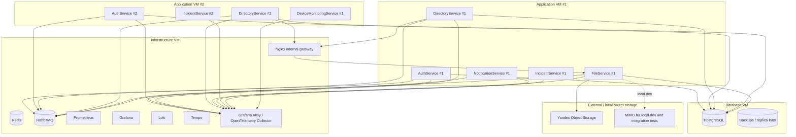

### Инстансы сервисов

| Service | Instance count | Где живет | Комментарий |
| --- | ---: | --- | --- |
| `AuthService` | 2 | Application VM #1, Application VM #2 | Горизонтально масштабируется, должен быть stateless относительно HTTP-запросов. |
| `DirectoryService` | 2 | Application VM #1, Application VM #2 | Может синхронно обращаться к `FileService` через внутренний gRPC endpoint. |
| `IncidentService` | 2 | Application VM #1, Application VM #2 | Планируемый/развиваемый сервис инцидентов. |
| `NotificationService` | 1 | Application VM #1 | Хороший кандидат на RabbitMQ consumer. |
| `FileService` | 1 | Application VM #1 | Пока single-instance; для sync-вызовов это runtime dependency и потенциальная single point of failure. |
| `DeviceMonitoringService` | 1 | Application VM #2 | Отдельный сервис мониторинга устройств. |
| `PostgreSQL` | 1 primary | Database VM | Backups обязательны; replica может появиться позже. |
| `Redis` | 1 | Infrastructure VM | Кэш, distributed locks или runtime state, если они понадобятся. |
| `RabbitMQ` | 1 | Infrastructure VM | Основной канал async events между сервисами. |
| Observability stack | 1 set | Infrastructure VM | Prometheus, Grafana, Loki, Tempo, Alloy / OTel Collector. |
| Object Storage | external | Yandex Object Storage | Production storage для файлов. |
| MinIO | local only | local dev / tests | S3-compatible storage для разработки и интеграционных тестов. |

### Что эта схема значит для gRPC

`DirectoryService` имеет 2 инстанса, а `FileService` пока 1. Поэтому оба инстанса `DirectoryService`
должны ходить не напрямую в конкретный process/container `FileService`, а в стабильный внутренний адрес:

```text
file-service.internal:50051
```

За этим адресом может стоять nginx:

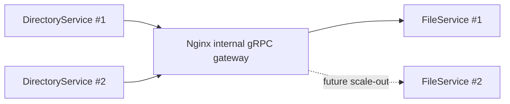

Сейчас `FileService #1` остается единственным обработчиком gRPC-запросов. Это нормально для обучения и первого этапа,
но важно понимать последствие: если `FileService` недоступен, команда в `DirectoryService`, которой нужен sync existence check,
тоже не сможет завершиться успешно.

### Что эта схема значит для RabbitMQ

RabbitMQ находится на `Infrastructure VM`, поэтому оба application VM могут публиковать и читать события из одного broker.
Это удобно для событий, которые не требуют немедленного ответа:

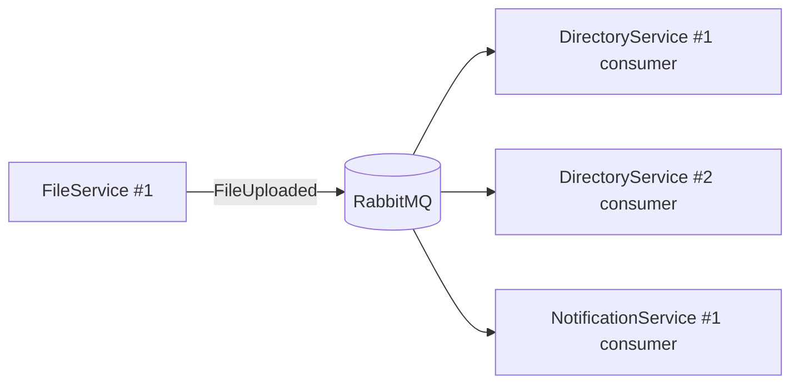

Если один consumer временно недоступен, событие может быть обработано позже. Это главное отличие от gRPC:
gRPC-вызов нужен "прямо сейчас", RabbitMQ-событие нужно "надежно доставить и обработать".

## Короткое правило

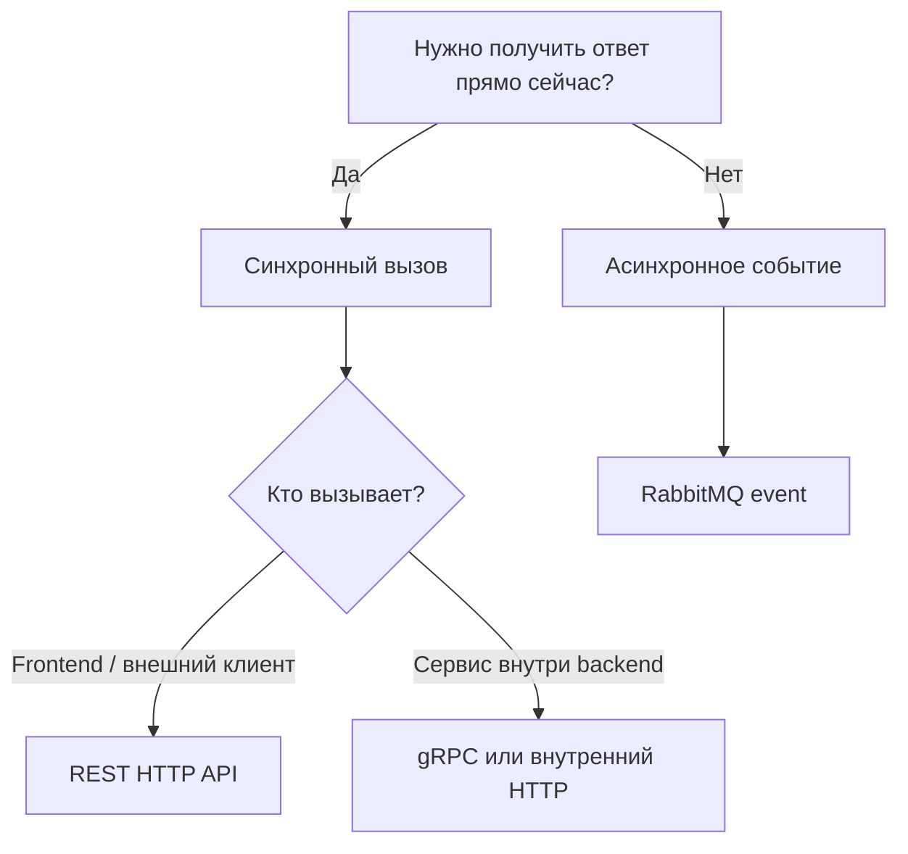

- `REST HTTP` - внешний API для frontend, Swagger, Postman, ручной отладки.
- `gRPC` - быстрый и строгий внутренний контракт между backend-сервисами.
- `RabbitMQ` - события между сервисами, когда не нужен немедленный ответ.

## Наш случай

`DirectoryService` общается с `FileService` через `IFileCommunicationService`.
Сейчас в этом интерфейсе три метода:

```csharp
Task<Result<GetMediaAssetResponse, Failure>> GetMediaAssetInfo(
    Guid mediaAssetId,
    CancellationToken cancellationToken);

Task<Result<GetMediaAssetsResponse, Failure>> GetMediaAssetsInfo(
    GetMediaAssetsRequest request,
    CancellationToken cancellationToken);

Task<Result<CheckMediaAssetExistResponse, Failure>> CheckMediaAssetExists(
    Guid mediaAssetId,
    CancellationToken cancellationToken);
```

Все три метода являются синхронными запросами: `DirectoryService` ожидает ответ от `FileService`
в рамках текущего command/query flow.

### Existence check

`DirectoryService` проверяет видео у `FileService` перед сохранением `VideoId` у department.

Код в `DirectoryService`:

```csharp
var existResult = await _fileCommunicationService.CheckMediaAssetExists(
    command.Request.VideoId.Value,
    cancellationToken);

if (existResult.IsFailure)
    return existResult.Error;

if (!existResult.Value.IsExist)
    return Errors.General.NotFoundEntity("video").ToFailure();
```

Это синхронный сценарий: `DirectoryService` не может корректно завершить команду, пока не узнает,
существует ли media asset в `FileService`.

Значит здесь допустим gRPC:

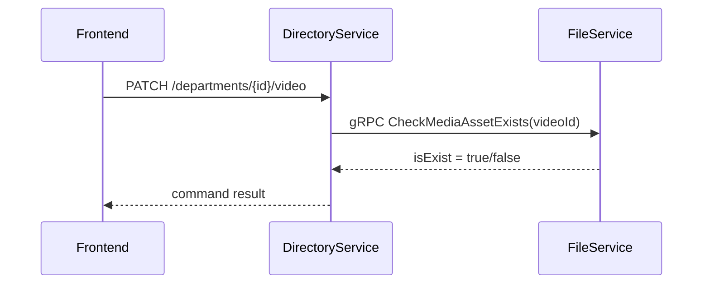

RabbitMQ здесь хуже подходит как основной механизм, потому что команде нужен ответ сразу.

### Single metadata read

`GetMediaAssetInfo` получает информацию по одному media asset.
Это подходит для gRPC, когда один backend-сервису нужен точный ответ от `FileService` прямо сейчас.

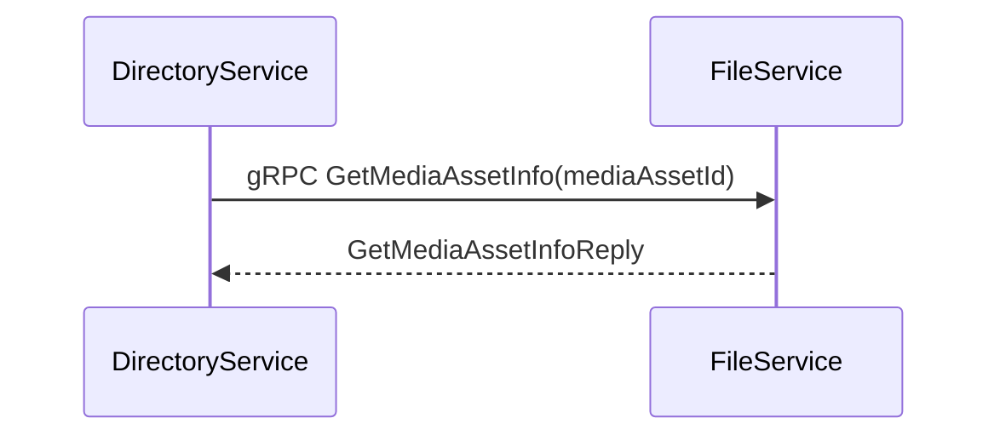

### Batch metadata read

`GetMediaAssetsInfo` получает информацию сразу по нескольким media asset ids.
Это лучше, чем делать N отдельных запросов:

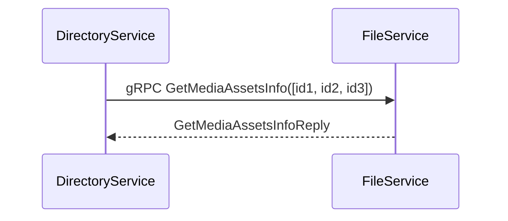

Итог по нашему интерфейсу:

- `CheckMediaAssetExists` - gRPC existence check;
- `GetMediaAssetInfo` - gRPC single metadata read;
- `GetMediaAssetsInfo` - gRPC batch metadata read.

## Где RabbitMQ подходит лучше

RabbitMQ нужен там, где сервис сообщает факт, а другие сервисы реагируют позже.

Примеры для нашего проекта:

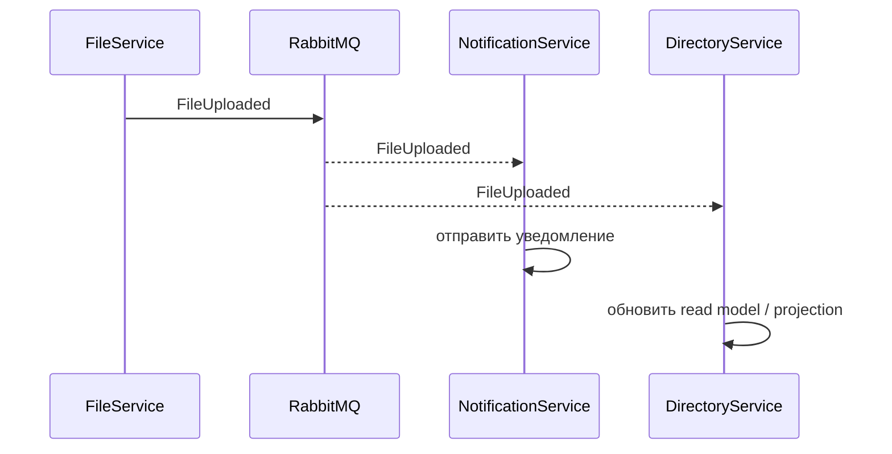

Подходящие события:

- `FileUploaded`
- `FileDeleted`
- `VideoProcessingStarted`
- `VideoProcessingCompleted`
- `AvatarChanged`

Событие не должно использоваться как прямой вопрос: "существует ли файл прямо сейчас?".
Событие отвечает на другой тип задачи: "что-то произошло, обработайте это когда сможете".

## Термины простыми словами

`existence check` - проверка существования.
Пример: `DirectoryService` спрашивает у `FileService`, есть ли media asset с таким `Guid`.

`batch metadata endpoint` - endpoint, который получает данные сразу по пачке id.
Пример: вместо 20 отдельных запросов по одному файлу отправляем один запрос со списком id.

`read enrichment` - обогащение read-модели данными из другого сервиса.
Пример: `DirectoryService` отдает departments, но подтягивает из `FileService` информацию по изображениям или видео,
чтобы frontend получил более удобный ответ.

## Почему gRPC хорошо подходит для внутреннего вызова

gRPC дает:

- строгий контракт через `.proto`;
- генерацию клиента и сервера;
- меньше ручной работы с URL и JSON;
- хороший формат для service-to-service communication;
- явные request/response модели.

Но gRPC не заменяет RabbitMQ. Это разные инструменты.

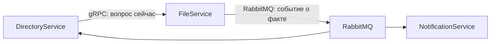

## Ошибки в gRPC

В gRPC нет нашего доменного `Errors.General` или общего статического класса ошибок.
Там есть стандартные transport-коды статуса:

- `StatusCode.InvalidArgument` - клиент передал некорректный request;
- `StatusCode.NotFound` - ресурс не найден;
- `StatusCode.PermissionDenied` - нет прав;
- `StatusCode.Unauthenticated` - не прошла authentication;
- `StatusCode.Unavailable` - сервис временно недоступен;
- `StatusCode.DeadlineExceeded` - истек timeout/deadline;
- `StatusCode.Internal` - внутренняя ошибка сервиса.

На server-side ошибка выбрасывается как `RpcException`:

```csharp
throw new RpcException(
    new Status(StatusCode.InvalidArgument, "Invalid media asset id"));
```

На client-side adapter ловит `RpcException` и переводит transport-ошибку обратно в наш `Failure`:

```csharp
catch (RpcException ex)
{
    return Error.Failure("file-service.grpc", ex.Status.Detail).ToFailure();
}
```

Так application layer продолжает работать с `Result<T, Failure>`, а детали gRPC остаются внутри transport/adapter слоя.

## Как это будет выглядеть через Contracts NuGet

Мы не должны связывать `DirectoryService` напрямую с проектом `FileService.Contracts` через `ProjectReference`
как финальное решение. Для микросервисной архитектуры лучше такой процесс:

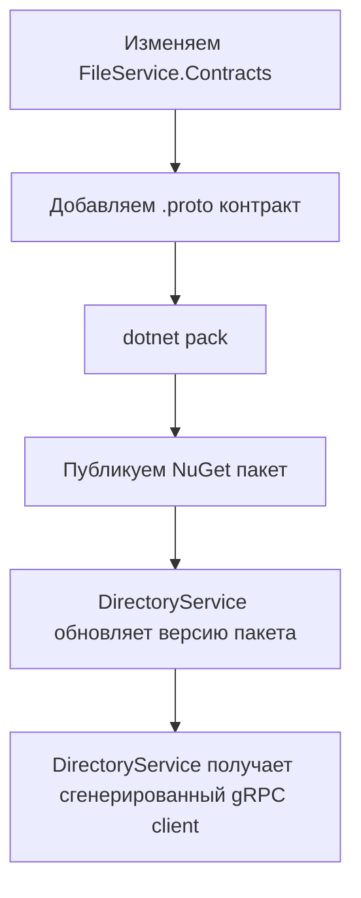

То есть `FileService.Contracts` становится пакетом с публичным контрактом сервиса.
`DirectoryService` не знает внутреннюю реализацию `FileService`, он знает только контракт.

## Пример proto-контракта

Файл может жить в `FileService.Contracts/Protos/file_internal.proto`.

```proto
syntax = "proto3";

option csharp_namespace = "FileService.Contracts.Grpc";

package file.v1;

service FileInternal {
  rpc GetMediaAssetInfo(GetMediaAssetInfoRequest)
      returns (GetMediaAssetInfoReply);

  rpc GetMediaAssetsInfo(GetMediaAssetsInfoRequest)
      returns (GetMediaAssetsInfoReply);

  rpc CheckMediaAssetExists(CheckMediaAssetExistsRequest)
      returns (CheckMediaAssetExistsReply);
}

message GetMediaAssetInfoRequest {
  string media_asset_id = 1;
}

message GetMediaAssetInfoReply {
  string id = 1;
  string status = 2;
  string asset_type = 3;
  string created_at = 4;
  string updated_at = 5;
  optional string view_url = 6;
  optional string download_url = 7;
  optional string thumbnail_url = 8;
  optional int64 size = 9;
  optional string file_name = 10;
  optional string content_type = 11;
}

message GetMediaAssetsInfoRequest {
  repeated string media_asset_ids = 1;
}

message MediaAssetInfoItem {
  string id = 1;
  string status = 2;
  string asset_type = 3;
  optional string view_url = 4;
  optional string download_url = 5;
  optional string thumbnail_url = 6;
}

message GetMediaAssetsInfoReply {
  repeated MediaAssetInfoItem media_assets = 1;
}

message CheckMediaAssetExistsRequest {
  string media_asset_id = 1;
}

message CheckMediaAssetExistsReply {
  bool is_exist = 1;
}
```

Почему `string`, а не специальный `Guid`: в protobuf нет отдельного стандартного типа `Guid`.
Для простоты и совместимости передаем `Guid` строкой.

Почему появился `CheckMediaAssetExistsReply`, если уже есть `CheckMediaAssetExistResponse`:
gRPC-контракт описывается через `.proto`, и C# классы генерируются из `message`.
Поэтому для transport layer нужен отдельный protobuf message. В adapter он сразу преобразуется обратно
в старый `CheckMediaAssetExistResponse`, чтобы application-код `DirectoryService` не зависел от gRPC DTO.

## Как выбирать protobuf-типы

`.proto` не использует C# типы напрямую. Он использует свои primitive types, которые потом генерируются в C#.
Поэтому при проектировании контракта нужно явно решить, как C# DTO переводится в protobuf message.

### Базовая таблица mapping

| C# тип | Protobuf тип | Почему так |
| --- | --- | --- |
| `string` | `string` | Прямое соответствие. |
| `bool` | `bool` | Прямое соответствие. |
| `int` | `int32` | 32-bit integer. |
| `long` | `int64` | 64-bit integer, подходит для размера файла. |
| `Guid` | `string` | В protobuf нет стандартного `Guid`, поэтому передаем строкой. |
| `DateTime` | `string` или `google.protobuf.Timestamp` | Для KISS можно ISO string; для строгого контракта лучше `Timestamp`. |
| `decimal` | `string` или custom message | В protobuf нет точного decimal; для денег обычно делают отдельный Money/Decimal message. |
| `enum` | `enum` или `string` | `enum` строже, `string` проще при текущих C# enum-to-string ответах. |
| `List<T>` / `IReadOnlyList<T>` | `repeated T` | Protobuf repeated field = список. |
| nullable value | `optional T` | Позволяет отличить "значение не пришло" от default value. |
| nullable reference | `optional string` | Позволяет сохранить смысл `null`, а не превращать его в пустую строку. |

### Как мы мапим текущие DTO

C# DTO:

```csharp
public record GetMediaAssetResponse(
    Guid Id,
    string Status,
    string AssetType,
    DateTime CreatedAt,
    DateTime UpdatedAt,
    string? ViewUrl,
    string? DownloadUrl,
    string? ThumbnailUrl,
    long? Size,
    string? FileName,
    string? ContentType);
```

Protobuf message:

```proto
message GetMediaAssetInfoReply {
  string id = 1;
  string status = 2;
  string asset_type = 3;
  string created_at = 4;
  string updated_at = 5;
  optional string view_url = 6;
  optional string download_url = 7;
  optional string thumbnail_url = 8;
  optional int64 size = 9;
  optional string file_name = 10;
  optional string content_type = 11;
}
```

Почему так:

- `Guid Id` -> `string id`: protobuf не знает `Guid`;
- `string Status` -> `string status`: сейчас status уже приходит как строка;
- `string AssetType` -> `string asset_type`: сейчас asset type уже приходит как строка;
- `DateTime CreatedAt` -> `string created_at`: для KISS передаем ISO-8601 строку;
- `DateTime UpdatedAt` -> `string updated_at`: то же правило;
- `string? ViewUrl` -> `optional string view_url`: поле может отсутствовать;
- `long? Size` -> `optional int64 size`: размер файла может отсутствовать, но если есть - это 64-bit number.

### Почему `optional`

В protobuf у обычного primitive field всегда есть default value:

- `string` default = `""`;
- `bool` default = `false`;
- `int64` default = `0`.

Если написать так:

```proto
int64 size = 9;
```

то на C# стороне будет сложно понять:

- размер реально `0`;
- или размер вообще не был указан.

Поэтому для nullable C# поля лучше:

```proto
optional int64 size = 9;
```

Тогда generated C# class получает дополнительный признак:

```csharp
reply.HasSize
```

И adapter может корректно вернуть `null`:

```csharp
reply.HasSize ? reply.Size : null
```

### Что такое field numbers: `1`, `2`, `3`

В protobuf каждое поле получает номер:

```proto
message MediaAssetInfoItem {
  string id = 1;
  string status = 2;
  string asset_type = 3;
}
```

Эти числа - не порядок для красоты. Это часть binary contract.
В gRPC/protobuf по сети передаются не имена `id`, `status`, `asset_type`, а field numbers.

Условно:

```text
1 -> id
2 -> status
3 -> asset_type
```

Почему это важно:

- field number должен быть стабильным;
- нельзя менять смысл существующего номера;
- нельзя удалить поле, а потом использовать его номер для другого смысла;
- новые поля добавляются с новыми номерами.

Правильно:

```proto
message MediaAssetInfoItem {
  string id = 1;
  string status = 2;
  string asset_type = 3;
  optional string view_url = 4;
}
```

Неправильно:

```proto
message MediaAssetInfoItem {
  string id = 1;
  string asset_type = 2; // плохо: раньше номер 2 был status
  string status = 3;     // плохо: раньше номер 3 был asset_type
}
```

Даже если имена выглядят нормальными, старый client может прочитать данные неправильно,
потому что он ориентируется на номера.

### Как добавлять новые поля

Допустим, хотим добавить `duration_seconds`.

Было:

```proto
message MediaAssetInfoItem {
  string id = 1;
  string status = 2;
  string asset_type = 3;
}
```

Делаем:

```proto
message MediaAssetInfoItem {
  string id = 1;
  string status = 2;
  string asset_type = 3;
  optional int32 duration_seconds = 4;
}
```

Новый client увидит поле.
Старый client просто проигнорирует неизвестное поле `4`.

### Как удалять поля

Если поле больше не нужно, номер лучше зарезервировать.

Было:

```proto
message MediaAssetInfoItem {
  string id = 1;
  string status = 2;
  string old_field = 3;
}
```

Стало:

```proto
message MediaAssetInfoItem {
  reserved 3;
  reserved "old_field";

  string id = 1;
  string status = 2;
}
```

Это защищает от случайного переиспользования номера `3` в будущем.

### Как самому спроектировать следующий protobuf message

Порядок:

1. Найти C# request/response DTO.
2. Выписать все поля и их C# типы.
3. Для каждого поля выбрать protobuf primitive type по таблице mapping.
4. Nullable поля сделать `optional`.
5. Коллекции сделать `repeated`.
6. Дать каждому полю стабильный number.
7. Не менять уже опубликованные numbers.
8. Добавить RPC метод в `service`.
9. Сгенерировать build-ом C# types.
10. Написать mapping в server-side gRPC service.
11. Написать reverse mapping в client-side adapter.

Мини-шаблон:

```proto
service SomeInternal {
  rpc GetSomething(GetSomethingRequest)
      returns (GetSomethingReply);
}

message GetSomethingRequest {
  string id = 1;
}

message GetSomethingReply {
  string id = 1;
  string name = 2;
  optional string description = 3;
  repeated string tags = 4;
}
```

### Когда лучше использовать `Timestamp`

Для обучения мы используем:

```proto
string created_at = 4;
```

и передаем `DateTime` как ISO-8601:

```csharp
CreatedAt = mediaAsset.CreatedAt.ToString("O")
```

Это просто и понятно.

В более строгом production-контракте можно использовать:

```proto
import "google/protobuf/timestamp.proto";

google.protobuf.Timestamp created_at = 4;
```

Плюсы `Timestamp`:

- это стандартный protobuf тип для времени;
- меньше риска неправильного парсинга строки;
- лучше для разных языков.

Минусы для обучения:

- нужно импортировать protobuf well-known type;
- нужно мапить `DateTime` в `Timestamp` и обратно;
- код становится сложнее.

Поэтому сейчас выбран KISS-вариант через ISO string, но в будущем `Timestamp` будет более строгим вариантом.

## Response DTO vs protobuf Reply DTO

В проекте уже есть обычные C# DTO:

```csharp
public record GetMediaAssetsResponse(IReadOnlyList<GetMediaAssetDto> MediaAssets);

public record GetMediaAssetDto(
    Guid Id,
    string Status,
    string AssetType,
    string? ViewUrl,
    string? DownloadUrl,
    string? ThumbnailUrl);
```

Они нужны для application/HTTP слоя:

- удобно использовать в C# коде;
- можно вернуть из Minimal API / Controller;
- можно сериализовать в JSON;
- можно использовать в `Result<T, Failure>`;
- можно менять в рамках C# проекта.

Для gRPC появляются отдельные protobuf DTO:

```proto
message GetMediaAssetsInfoReply {
  repeated MediaAssetInfoItem media_assets = 1;
}

message MediaAssetInfoItem {
  string id = 1;
  string status = 2;
  string asset_type = 3;
  optional string view_url = 4;
  optional string download_url = 5;
  optional string thumbnail_url = 6;
}
```

Они нужны для transport layer:

- gRPC контракт должен быть описан в `.proto`;
- C# классы генерируются из `.proto`;
- protobuf использует свои правила типов, field numbers и совместимости;
- контракт может использоваться не только C#, но и Go/Java/Node/Python сервисом;
- client и server получают одинаковую generated-модель из одного proto.

### Почему нельзя просто использовать старый `GetMediaAssetsResponse`

Потому что gRPC не работает как JSON serializer поверх произвольных C# records.
Он работает через protobuf contract.

Для gRPC важны:

- `message` - структура данных;
- `service` - набор методов;
- `rpc` - конкретный вызов;
- field numbers: `id = 1`, `status = 2`;
- стабильность контракта между версиями.

Обычный C# record:

```csharp
public record GetMediaAssetsResponse(IReadOnlyList<GetMediaAssetDto> MediaAssets);
```

понятен .NET-приложению, но не является protobuf-контрактом.

### Почему типы выглядят почти одинаково

Потому что они описывают одни и те же данные, но для разных слоев:

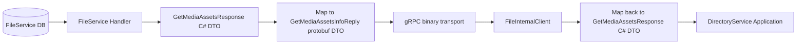

Главная идея: protobuf DTO не должен протекать в application layer.
Он должен жить около gRPC transport.

### Таблица отличий

| Тип | Где живет | Для чего нужен | Кто создает |
| --- | --- | --- | --- |
| `GetMediaAssetsResponse` | `FileService.Contracts.Responses` | C# application/HTTP DTO | Мы пишем вручную |
| `GetMediaAssetDto` | `FileService.Contracts` | элемент C# response | Мы пишем вручную |
| `GetMediaAssetsInfoReply` | generated из `.proto` | gRPC response message | `Grpc.Tools` генерирует |
| `MediaAssetInfoItem` | generated из `.proto` | элемент gRPC response | `Grpc.Tools` генерирует |

### Где происходит перевод

Server-side:

```csharp
GetMediaAssetsResponse response = result.Value;

var reply = new GetMediaAssetsInfoReply();

reply.MediaAssets.AddRange(response.MediaAssets.Select(mediaAsset => new MediaAssetInfoItem
{
    Id = mediaAsset.Id.ToString(),
    Status = mediaAsset.Status,
    AssetType = mediaAsset.AssetType
}));

return reply;
```

Client-side adapter:

```csharp
var mediaAssets = reply.MediaAssets.Select(mediaAsset => new GetMediaAssetDto(
        Guid.Parse(mediaAsset.Id),
        mediaAsset.Status,
        mediaAsset.AssetType,
        mediaAsset.HasViewUrl ? mediaAsset.ViewUrl : null,
        mediaAsset.HasDownloadUrl ? mediaAsset.DownloadUrl : null,
        mediaAsset.HasThumbnailUrl ? mediaAsset.ThumbnailUrl : null))
    .ToList();

return new GetMediaAssetsResponse(mediaAssets);
```

То есть `Reply` - это DTO для gRPC-провода, а `Response` - DTO для нашего C# application-кода.

### Почему это нормальная практика

В реальных проектах часто есть отдельные модели:

- domain model;
- application DTO;
- HTTP request/response DTO;
- protobuf/gRPC message;
- database entity/read model.

Это не всегда приятно из-за mapping-кода, но зато границы слоев остаются понятными.
Если завтра мы изменим HTTP response, это не обязано ломать gRPC contract.
Если завтра мы изменим protobuf contract, это не обязано протекать в domain/application код.

## Пример server-side реализации в FileService

Идея: gRPC-методы используют ту же бизнес-логику, что и текущие HTTP endpoints.

```csharp
public sealed class FileInternalGrpcService : FileInternal.FileInternalBase
{
    private readonly GetMediaAssetInfoHandler _getMediaAssetInfoHandler;
    private readonly GetMediaAssetsInfoHandler _getMediaAssetsInfoHandler;
    private readonly CheckMediaAssetExistHandler _checkMediaAssetExistHandler;

    public override async Task<CheckMediaAssetExistsReply> CheckMediaAssetExists(
        CheckMediaAssetExistsRequest request,
        ServerCallContext context)
    {
        if (!Guid.TryParse(request.MediaAssetId, out Guid mediaAssetId))
        {
            throw new RpcException(new Status(StatusCode.InvalidArgument, "Invalid media asset id"));
        }

        var result = await _checkMediaAssetExistHandler.Handle(mediaAssetId, context.CancellationToken);

        if (result.IsFailure)
        {
            throw new RpcException(new Status(StatusCode.Internal, "Failed to check media asset"));
        }

        return new CheckMediaAssetExistsReply
        {
            IsExist = result.Value.IsExist
        };
    }

    public override async Task<GetMediaAssetInfoReply> GetMediaAssetInfo(...)
    {
        // parse Guid -> call GetMediaAssetInfoHandler -> map C# Response DTO to protobuf Reply DTO
    }

    public override async Task<GetMediaAssetsInfoReply> GetMediaAssetsInfo(...)
    {
        // parse ids -> call GetMediaAssetsInfoHandler -> map batch C# Response DTO to protobuf Reply DTO
    }
}
```

Регистрация в `FileService.Web`:

```csharp
builder.Services.AddGrpc();

app.MapGrpcService<FileInternalGrpcService>();
```

## Пример client-side адаптера в Contracts

`DirectoryService` уже зависит от интерфейса:

```csharp
public interface IFileCommunicationService
{
    Task<Result<GetMediaAssetResponse, Failure>> GetMediaAssetInfo(...);
    Task<Result<GetMediaAssetsResponse, Failure>> GetMediaAssetsInfo(...);
    Task<Result<CheckMediaAssetExistResponse, Failure>> CheckMediaAssetExists(
        Guid mediaAssetId,
        CancellationToken cancellationToken);
}
```

Можно оставить этот интерфейс, а внутри реализации заменить конкретный транспорт на gRPC:

```csharp
internal sealed class FileCommunicationClient : IFileCommunicationService
{
    private readonly FileInternal.FileInternalClient _grpcClient;

    public FileCommunicationClient(FileInternal.FileInternalClient grpcClient)
    {
        _grpcClient = grpcClient;
    }

    public async Task<Result<GetMediaAssetResponse, Failure>> GetMediaAssetInfo(...)
    {
        // call GetMediaAssetInfoAsync -> map protobuf Reply DTO to old C# Response DTO
    }

    public async Task<Result<GetMediaAssetsResponse, Failure>> GetMediaAssetsInfo(...)
    {
        // call GetMediaAssetsInfoAsync -> map protobuf Reply DTO to old C# Response DTO
    }

    public async Task<Result<CheckMediaAssetExistResponse, Failure>> CheckMediaAssetExists(
        Guid mediaAssetId,
        CancellationToken cancellationToken)
    {
        try
        {
            var reply = await _grpcClient.CheckMediaAssetExistsAsync(
                new CheckMediaAssetExistsRequest
                {
                    MediaAssetId = mediaAssetId.ToString()
                },
                cancellationToken: cancellationToken);

            return new CheckMediaAssetExistResponse(reply.IsExist);
        }
        catch (RpcException ex)
        {
            return Error.Failure("file-service.grpc", ex.Status.Detail).ToFailure();
        }
    }
}
```

Это пример Adapter pattern: код `DirectoryService` продолжает работать с `IFileCommunicationService`,
а детали gRPC transport и protobuf DTO спрятаны внутри адаптера.

## Nginx и несколько инстансов

В твоей схеме:

- `DirectoryService` имеет 2 instance;
- `FileService` пока имеет 1 instance;
- инфраструктура живет отдельно;
- nginx уже есть и может быть внутренней точкой входа.

Для `DirectoryService` лучше не знать конкретный адрес контейнера или VM с `FileService`.
Он должен знать стабильный адрес:

```text
file-service.internal:50051
```

Nginx может проксировать gRPC:

```nginx
server {
    listen 50051 http2;

    location / {
        grpc_pass grpc://file-service:50051;
    }
}
```

Если потом появится `FileService instance #2`, меняется nginx/upstream, а не код `DirectoryService`.

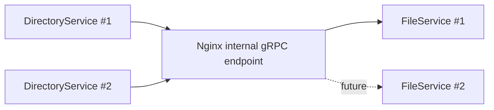

## Flow запроса через nginx и gRPC

Пример: пользователь меняет видео department.

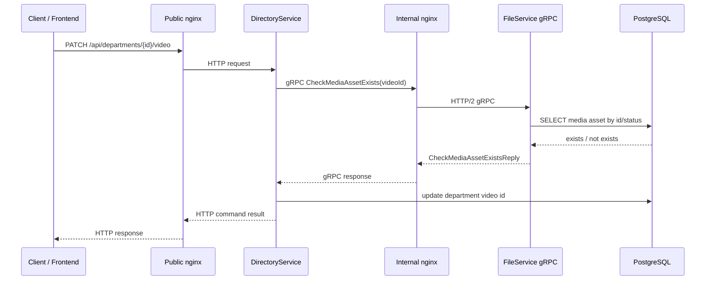

Что здесь важно:

- внешний клиент не знает про gRPC;
- внешний API остается обычным HTTP/REST;
- gRPC используется только внутри backend-сети;
- `DirectoryService` ходит в стабильный internal endpoint, а не в конкретный instance `FileService`;
- `FileService` все равно остается владельцем своей базы и сам проверяет media asset.

## Правильный flow настройки nginx + gRPC

Организация межсервисного gRPC через nginx должна идти в таком порядке:

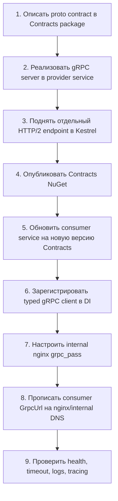

### 1. Контракт

Контракт кладем в `FileService.Contracts`, потому что это публичная граница `FileService` для других backend-сервисов.

```proto
service FileInternal {
  rpc CheckMediaAssetExists(CheckMediaAssetExistsRequest)
      returns (CheckMediaAssetExistsReply);
}
```

### 2. Server-side service

`FileService` реализует generated base class:

```csharp
public sealed class FileInternalGrpcService : FileInternal.FileInternalBase
{
}
```

Бизнес-логику не дублируем: gRPC service вызывает существующий handler.

#### Откуда берется `FileInternalBase`

`FileInternalBase` мы не пишем вручную. Этот класс генерируется автоматически из `.proto` файла.

В `FileService.Contracts.csproj` есть строка:

```xml
<Protobuf Include="Grpc\Protos\file_internal.proto" GrpcServices="Both" />
```

Что она делает:

- `Grpc\Protos\file_internal.proto` - путь к protobuf-контракту;
- `GrpcServices="Both"` - генерировать и server-side base class, и client-side typed client;
- `Grpc.Tools` - NuGet-пакет, который выполняет генерацию во время build.

Из этого proto:

```proto
service FileInternal {
  rpc CheckMediaAssetExists(CheckMediaAssetExistsRequest)
      returns (CheckMediaAssetExistsReply);
}
```

генерируются C# типы примерно такого смысла:

```csharp
public static class FileInternal
{
    public abstract class FileInternalBase
    {
        public virtual Task<CheckMediaAssetExistsReply> CheckMediaAssetExists(
            CheckMediaAssetExistsRequest request,
            ServerCallContext context);
    }

    public sealed class FileInternalClient
    {
        public AsyncUnaryCall<CheckMediaAssetExistsReply> CheckMediaAssetExistsAsync(
            CheckMediaAssetExistsRequest request);
    }
}
```

Это упрощенный пример, не точная копия generated code.

Что мы пишем сами:

- `.proto` контракт;
- `FileInternalGrpcService : FileInternal.FileInternalBase`;
- override метода `CheckMediaAssetExists`;
- вызов существующего application handler.

Что генерируется автоматически:

- `FileInternalBase` для server-side реализации;
- `FileInternalClient` для client-side вызова;
- `CheckMediaAssetExistsRequest`;
- `CheckMediaAssetExistsReply`;
- serialization/deserialization logic для protobuf.

Идея простая: `.proto` - это контракт, а generated classes - техническая обвязка вокруг него.

#### Почему методы `override`

В `.proto` мы описываем RPC-методы:

```proto
service FileInternal {
  rpc CheckMediaAssetExists(CheckMediaAssetExistsRequest)
      returns (CheckMediaAssetExistsReply);
}
```

После генерации `Grpc.Tools` создает base class примерно такого смысла:

```csharp
public abstract class FileInternalBase
{
    public virtual Task<CheckMediaAssetExistsReply> CheckMediaAssetExists(
        CheckMediaAssetExistsRequest request,
        ServerCallContext context)
    {
        throw new NotImplementedException();
    }
}
```

Это означает: gRPC знает, что у сервиса должен быть метод `CheckMediaAssetExists`,
но не знает нашу бизнес-логику.

Поэтому в `FileInternalGrpcService` мы наследуемся от generated base class и переопределяем метод:

```csharp
public override async Task<CheckMediaAssetExistsReply> CheckMediaAssetExists(
    CheckMediaAssetExistsRequest request,
    ServerCallContext context)
{
    // наша логика: parse Guid -> вызвать handler -> вернуть reply
}
```

`override` здесь значит: "взять метод из generated base class и дать ему реальную реализацию".

Без `override` ASP.NET Core gRPC не поймет, какую нашу логику вызывать для RPC-метода из `.proto`.

### 3. Kestrel endpoint

Для Docker у `FileService` отдельный порт под gRPC:

```json
"Grpc": {
  "Url": "http://0.0.0.0:50051",
  "Protocols": "Http2"
}
```

Смысл:

- `50051` - внутренний gRPC port;
- `Http2` - обязательный протокол для gRPC;
- REST/Swagger остаются на отдельном HTTP/1 endpoint.

#### Зачем Kestrel-настройки в appsettings

Kestrel - это встроенный web server ASP.NET Core. Именно он слушает порты внутри процесса `FileService`.

Обычно для простого REST API хватает:

```text
ASPNETCORE_URLS=http://+:8080
```

Но для gRPC нам важно указать не только порт, но и протокол.
gRPC работает поверх HTTP/2. Если endpoint будет слушать только HTTP/1.1, gRPC-вызов не пройдет.

Поэтому мы явно настраиваем два endpoint:

```json
"Kestrel": {
  "Endpoints": {
    "Http": {
      "Url": "http://0.0.0.0:8080",
      "Protocols": "Http1"
    },
    "Grpc": {
      "Url": "http://0.0.0.0:50051",
      "Protocols": "Http2"
    }
  }
}
```

Что делает каждая часть:

- `Http` - обычный REST/Swagger endpoint сервиса;
- `Url: http://0.0.0.0:8080` - слушать порт `8080` на всех сетевых интерфейсах контейнера;
- `Protocols: Http1` - этот endpoint принимает обычные HTTP/1.1 запросы;
- `Grpc` - отдельный internal endpoint для gRPC;
- `Url: http://0.0.0.0:50051` - слушать gRPC port `50051`;
- `Protocols: Http2` - этот endpoint принимает HTTP/2, который нужен gRPC.

Почему не смешиваем REST и gRPC на одном plaintext-порту:

- локально проще понимать, какой порт за что отвечает;
- nginx проще настроить: `proxy_pass` для REST, `grpc_pass` для gRPC;
- меньше риска случайно отправить gRPC на HTTP/1.1 endpoint;
- в логах и docker-compose видно отдельную границу internal API.

В production можно сделать сложнее: TLS, ALPN, единый ingress, service mesh.
Для нашего обучения KISS-вариант лучше: отдельный REST port и отдельный gRPC port.

### 4. Contracts NuGet

После изменения `.proto` нужно собрать и опубликовать новую версию contracts package:

```powershell
dotnet pack backend\FileService\FileService.Contracts\FileService.Contracts.csproj -c Release
```

Потом consumer services обновляют версию `IstredDev.FileService.Contracts`.

### 5. Consumer-side typed client

В `FileService.Contracts` регистрируется typed client:

```csharp
services.AddGrpcClient<FileInternal.FileInternalClient>((sp, config) =>
{
    FileServiceOptions options = sp.GetRequiredService<IOptions<FileServiceOptions>>().Value;
    config.Address = new Uri(options.GrpcUrl);
});
```

Смысл:

- `AddGrpcClient` добавляет generated gRPC client в DI;
- `GrpcUrl` указывает на internal endpoint;
- application-код не создает gRPC client вручную.

### 6. Adapter

Consumer service не должен зависеть напрямую от `Grpc.Core`.
Поэтому gRPC client прячется за adapter:

```csharp
public async Task<Result<CheckMediaAssetExistResponse, Failure>> CheckMediaAssetExists(
    Guid mediaAssetId,
    CancellationToken cancellationToken)
{
    var call = _grpcClient.CheckMediaAssetExistsAsync(
        new CheckMediaAssetExistsRequest
        {
            MediaAssetId = mediaAssetId.ToString()
        },
        cancellationToken: cancellationToken);

    var reply = await call.ResponseAsync.ConfigureAwait(false);

    return new CheckMediaAssetExistResponse(reply.IsExist);
}
```

### 7. Internal nginx

Минимальный пример nginx для gRPC:

```nginx
upstream file_service_grpc {
    server file-service:50051;
}

server {
    listen 50051 http2;

    location / {
        grpc_pass grpc://file_service_grpc;
    }
}
```

Если появится второй instance:

```nginx
upstream file_service_grpc {
    server file-service-1:50051;
    server file-service-2:50051;
}
```

Код `DirectoryService` при этом не меняется: он продолжает ходить в один стабильный `GrpcUrl`.

### 8. Configuration в consumer service

Для Docker:

```json
"FileServiceOptions": {
  "Url": "http://file-service:8080/",
  "GrpcUrl": "http://backend-nginx:50051/",
  "TimeoutSeconds": 10
}
```

Для локальной разработки без nginx можно временно ходить напрямую:

```json
"FileServiceOptions": {
  "Url": "http://localhost:8002/",
  "GrpcUrl": "http://localhost:50051/",
  "TimeoutSeconds": 10
}
```

Правило: прямой адрес сервиса допустим для local/dev, но для production лучше использовать internal DNS/nginx/load balancer.

### 9. Проверка

Минимальный checklist:

- `FileService` слушает gRPC endpoint `50051`;
- nginx слушает `50051 http2`;
- nginx использует `grpc_pass`, а не `proxy_pass`;
- `DirectoryService` смотрит `GrpcUrl` на nginx/internal DNS;
- timeout/deadline задан на client-side;
- `RpcException` переводится в `Failure`;
- логи и traces показывают цепочку `DirectoryService -> nginx -> FileService`.

## Нужен ли DevOps для этого

Для локального обучения и первого вертикального среза DevOps не нужен.
Достаточно backend-настроек:

- `.proto` в contracts project;
- NuGet packages для gRPC;
- `AddGrpc` и `MapGrpcService`;
- `AddGrpcClient`;
- отдельный Kestrel endpoint `Http2`;
- локальный Docker port mapping.

DevOps/infra часть понадобится позже, когда будем делать production-like окружение:

- internal DNS или service discovery;
- nginx/HAProxy/Traefik как стабильный internal endpoint;
- TLS или mTLS между сервисами, если потребуется;
- health checks;
- rate limits / connection limits;
- observability dashboards;
- deployment strategy для нескольких инстансов.

То есть для понимания и реализации backend-паттерна достаточно разработки.
Для production-качества нужна аккуратная инфраструктурная настройка, но это следующий слой, не обязательный для первого обучения.

## Важные практические правила

- Не делать gRPC-вызовы для всего подряд.
- Не использовать RabbitMQ там, где нужен немедленный ответ пользователю.
- Не давать сервисам ходить напрямую в чужую базу данных.
- Не хардкодить адрес конкретного instance.
- Для внутренних вызовов задавать timeout/deadline.
- Ошибки gRPC переводить в понятные `Failure`, чтобы application layer не зависел от transport exception.
- Service-to-service authentication добавить отдельным шагом, когда базовый gRPC-вызов уже работает.

## Как это делать в реальном рабочем проекте

В production-команде нельзя просто взять и кардинально заменить HTTP на gRPC между микросервисами без согласования.
Это меняет контракт, runtime dependencies, observability, deployment и поддержку.

Правильный порядок:

1. Найти существующую архитектурную документацию: ADR, tech design, service communication guidelines.
2. Проверить, есть ли уже принятый стандарт: REST, gRPC, messaging, service mesh, API gateway.
3. Обсудить с team lead / architect / владельцем сервиса.
4. Описать migration plan: что меняем, зачем, какие риски, как откатываемся.
5. Сохранить backward compatibility на время перехода: старый HTTP endpoint не удалять сразу.
6. Добавить observability: logs, metrics, traces, timeout/deadline, error mapping.
7. Выпустить новую версию contracts package.
8. Перевести consumer service на новую версию.
9. После проверки удалить старый путь, если команда решила, что он больше не нужен.

Для нашего проекта это учебный controlled change: мы оставляем `FileHttpClient` рядом, добавляем gRPC adapter,
не ломаем внешний REST API и документируем принятое решение.

## Что изучать по шагам

1. Как устроен `.proto` файл.
2. Как из `.proto` генерируются C# client/server классы.
3. Как `FileService` регистрирует gRPC server.
4. Как `DirectoryService` регистрирует typed gRPC client.
5. Как adapter прячет gRPC за `IFileCommunicationService`.
6. Как nginx проксирует gRPC через HTTP/2.
7. Как RabbitMQ остается каналом событий, а не заменой синхронных запросов.

## Наше решение

Для текущего проекта самый понятный и полезный путь:

- REST оставить для внешнего API и ручной отладки;
- RabbitMQ использовать для событий и eventual consistency;
- gRPC использовать для internal contract `DirectoryService` -> `FileService` по методам `IFileCommunicationService`;
- контракт gRPC положить в `FileService.Contracts`;
- распространять `FileService.Contracts` через NuGet;
- после публикации пакета обновлять версию в `DirectoryService`.

Так мы изучаем реальный production-подход, но не усложняем код раньше времени.

## Что реализовано в коде

Добавлен первый KISS-срез gRPC для `FileService` по всем методам `IFileCommunicationService`:

- `FileService.Contracts/Grpc/Protos/file_internal.proto` - protobuf-контракт internal API.
- `FileService.Contracts/HttpCommunication/FileCommunicationClient.cs` - adapter, который использует gRPC для `GetMediaAssetInfo`, `GetMediaAssetsInfo`, `CheckMediaAssetExists`.
- `FileService.Contracts/HttpCommunication/FileHttpClient.cs` - старый HTTP-only adapter оставлен для сравнения.
- `FileService.Core/Grpc/FileInternalGrpcService.cs` - server-side gRPC service, который переиспользует текущие handlers FileService.
- `FileService.Web/Configurations/GrpcExtensions.cs` - registration extension для `AddGrpc` и `MapGrpcService`.
- `AuthService` выдает service token через `POST /api/auth/service-token`.
- `FileService.Contracts` получает service token, кэширует его и добавляет Bearer token в gRPC metadata.
- `FileService` защищает gRPC service policy `file-service.internal`.

Почему через extension classes:

- в проекте уже есть стиль `AddCore()`, `AddS3()`, `AddPostgresInfrastructure()`, `WebConfigure()`;
- `Program.cs` остается коротким и показывает только общий pipeline;
- детали регистрации gRPC лежат рядом с web-конфигурацией FileService;
- такой стиль проще повторить для других сервисов.

Почему `FileCommunicationClient`, а не замена всей логики в `DirectoryService`:

- `DirectoryService` уже зависит от `IFileCommunicationService`;
- это сохраняет application layer независимым от транспорта;
- transport можно менять внутри contracts adapter: HTTP, gRPC или fallback;
- это практический пример Adapter pattern.

## Service-to-service token для gRPC

После базового gRPC-вызова мы добавили отдельную авторизацию для внутренних вызовов.
Главная идея: `DirectoryService` не должен ходить в `FileService` как анонимный internal client.
Даже если сервисы находятся в одной Docker/network/VM-сети, `FileService` должен понимать, кто именно его вызывает
и какое внутреннее право у этого caller service есть.

Для этого используется отдельный service JWT:

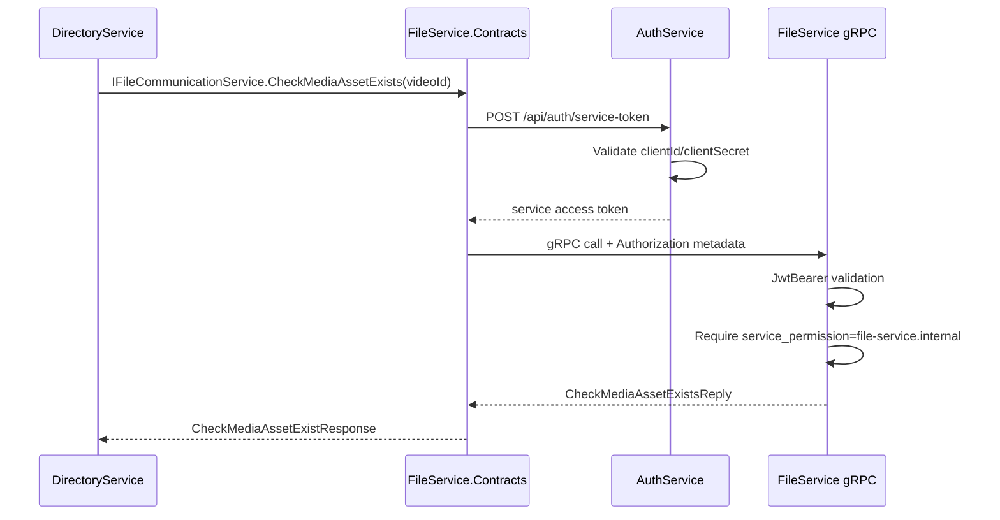

### Почему не используем пользовательский JWT

Пользовательский JWT отвечает на вопрос:

```text
Какой пользователь делает запрос и какие user permissions у него есть?
```

Service JWT отвечает на другой вопрос:

```text
Какой backend-сервис делает internal request и какие service permissions у него есть?
```

Это разные identities. В нашем случае `DirectoryService` вызывает `FileService` не потому, что frontend напрямую вызвал
`FileService`, а потому что внутри команды `DirectoryService` нужно проверить media asset.
Поэтому мы не прокидываем user permission `files.read`, а выдаем отдельное service permission:

```text
service_permission = file-service.internal
```

Так проще поддерживать границу:

- user endpoints проверяют `permission`;
- internal service endpoints проверяют `service_permission`;
- роли пользователя не смешиваются с правами backend-сервиса;
- `FileService` может разрешить только конкретные internal gRPC methods, не открывая весь файловый API.

### Какие claims есть в service JWT

Service token выпускается AuthService через `ITokenService.CreateServiceAccessToken`.
В token кладутся claims:

| Claim | Пример | Зачем нужен |
| --- | --- | --- |
| `sub` | `directory-service` | Основная identity service client. |
| `jti` | random guid | Уникальный id JWT. Полезен для логов, аудита и будущего revoke/deny-list. |
| `client_id` | `directory-service` | Технический id клиента из конфигурации. |
| `service_name` | `DirectoryService` | Читаемое имя сервиса для логов и диагностики. |
| `service_permission` | `file-service.internal` | Право на конкретный internal capability. |

Важно: service token не содержит user claim `permission`.
Это намеренное разделение. Если в будущем появятся другие внутренние права, они добавляются как новые
`service_permission`, например:

```text
directory-service.internal
notification-service.internal
incident-service.internal
```

### Где лежат client credentials

В `AuthService` есть конфигурация `ServiceClients`.
Она описывает список сервисов, которым можно получить service token:

```json
"ServiceClients": {
  "Clients": [
    {
      "ClientId": "directory-service",
      "ClientSecret": "local-dev-directory-service-client-secret-change-before-production",
      "ServiceName": "DirectoryService",
      "ServicePermissions": [
        "file-service.internal"
      ]
    }
  ]
}
```

Смысл полей:

- `ClientId` - стабильный технический id вызывающего сервиса;
- `ClientSecret` - shared secret, которым сервис доказывает AuthService, что он имеет право получить token;
- `ServiceName` - человекочитаемое имя для логов;
- `ServicePermissions` - список internal capabilities, которые будут добавлены в JWT.

Для local/dev эти значения можно держать в development env/config.
Для production secret нельзя коммитить в репозиторий: он должен приходить из secret storage, CI/CD variables,
Docker secrets, Kubernetes secrets или другого безопасного runtime-хранилища.

### Как DirectoryService получает token

Сам `DirectoryService` напрямую не знает про HTTP-вызов в AuthService.
Он как раньше работает с интерфейсом:

```csharp
IFileCommunicationService
```

Token получает adapter внутри пакета `FileService.Contracts`.
Для этого там есть:

- `IServiceTokenProvider` - маленький интерфейс получения access token;
- `AuthServiceTokenProvider` - реализация, которая ходит в AuthService;
- `FileCommunicationClient` - gRPC adapter, который перед вызовом добавляет Bearer token в metadata.

Схема:

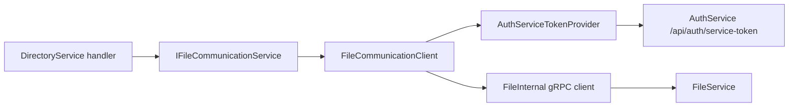

Такой подход оставляет application layer чистым:

- handler не знает про JWT;
- handler не знает про gRPC metadata;
- handler не знает URL AuthService;
- вся transport/security обвязка находится в infrastructure/adapter layer.

### Как token добавляется в gRPC request

В gRPC нет обычных HTTP headers в том виде, как в `HttpClient`, но есть metadata.
Для авторизации ASP.NET Core gRPC понимает metadata key `Authorization`:

```csharp
var headers = new Metadata
{
    { "Authorization", $"Bearer {accessToken}" }
};
```

После этого gRPC call уходит так:

```csharp
await _grpcClient.CheckMediaAssetExistsAsync(
    request,
    headers: headers,
    cancellationToken: cancellationToken);
```

Для `FileService` это выглядит как обычный authenticated request:

1. `JwtBearer` достает token из `Authorization`;
2. проверяет подпись, issuer, audience и lifetime;
3. создает `ClaimsPrincipal`;
4. authorization policy проверяет нужный claim.

### Почему token кэшируется

Если перед каждым gRPC-вызовом заново ходить в AuthService, получится лишняя нагрузка:

```text
DirectoryService -> AuthService -> FileService
DirectoryService -> AuthService -> FileService
DirectoryService -> AuthService -> FileService
```

Для частых internal вызовов это плохо:

- больше latency;
- лишняя нагрузка на AuthService;
- больше точек отказа;
- сложнее читать traces.

Поэтому `AuthServiceTokenProvider` кэширует token до expiration.
Перед истечением срока он обновляет token заранее с небольшим запасом:

```text
refresh skew = 30 seconds
```

То есть если token истекает через 10 секунд, provider уже считает его почти истекшим и запрашивает новый.
Это снижает шанс отправить в `FileService` token, который истек прямо во время network call.

### Почему нужен SemaphoreSlim

Если одновременно придет несколько запросов и token еще не получен или почти истек,
без синхронизации каждый request может пойти в AuthService за новым token.

`SemaphoreSlim` делает refresh последовательным:

```text
Request A получает lock и обновляет token
Request B ждет
Request C ждет
Request A сохранил token
Request B/C используют уже обновленный token
```

Это не business-lock, а маленькая техническая защита от лишних одновременных запросов в AuthService.

### Как FileService защищает gRPC endpoint

В `FileService` policy добавлена отдельно от пользовательских policies:

```csharp
options.AddPolicy(FileAuthorizationPolicies.FILE_SERVICE_INTERNAL, policy =>
{
    policy.RequireAuthenticatedUser();
    policy.RequireClaim("service_permission", "file-service.internal");
});
```

gRPC service подключается так:

```csharp
app.MapGrpcService<FileInternalGrpcService>()
    .RequireAuthorization(FileAuthorizationPolicies.FILE_SERVICE_INTERNAL);
```

Смысл:

- endpoint нельзя вызвать без JWT;
- обычного user JWT с `files.read` недостаточно;
- нужен именно service JWT с `service_permission=file-service.internal`;
- проверка находится на границе `FileService`, а не внутри handler.

### Что происходит при ошибках

Основные варианты:

| Ситуация | Где падает | Ожидаемый смысл |
| --- | --- | --- |
| `ClientId` или `ClientSecret` неверный | AuthService `/api/auth/service-token` | `DirectoryService` не может получить service token. |
| AuthService недоступен | `AuthServiceTokenProvider` | Internal call не может быть авторизован. |
| Token истек или неверно подписан | FileService JwtBearer | `401 Unauthorized`. |
| Token валиден, но нет `service_permission` | FileService authorization policy | `403 Forbidden`. |
| gRPC endpoint недоступен | gRPC client | `RpcException`, adapter переводит в `Failure`. |

На application layer `DirectoryService` продолжает видеть `Result<T, Failure>`.
Это важно: transport exception не должен протекать в бизнес-логику.

### Как это повторить для другого service-to-service вызова

Порядок действий:

1. Решить, нужен ли sync-вызов. Если нужен ответ прямо сейчас - подходит gRPC/internal HTTP.
2. В provider service создать отдельную internal permission, например `incident-service.internal`.
3. В AuthService добавить service client config с этим permission.
4. В Contracts package provider service добавить/обновить `.proto`.
5. В consumer-side adapter добавить получение service token.
6. В gRPC metadata добавлять `Authorization: Bearer <service-token>`.
7. В provider service повесить `.RequireAuthorization(...)` на gRPC endpoint.
8. Добавить integration tests:
   - валидный service client получает token;
   - неверный secret не получает token;
   - endpoint принимает token с правильным `service_permission`;
   - endpoint отклоняет token без нужного `service_permission`.

### Почему это нормальный production-подход

В реальных проектах часто разделяют:

- user authentication;
- service-to-service authentication;
- authorization policies на resource service boundary.

RabbitMQ при этом не исчезает. Он остается для событий.
Service token нужен именно там, где есть синхронный internal request и принимающий сервис должен проверить caller identity.

Для нашего проекта это разумный следующий шаг после gRPC:

- `DirectoryService` остается consumer;
- `FileService` остается owner файловых данных;
- `AuthService` становится issuer service tokens;
- `FileService.Contracts` скрывает transport/auth детали от application handlers.

## Как опубликовать Contracts NuGet после изменения proto

Пока `DirectoryService` зависит от опубликованного пакета `IstredDev.FileService.Contracts`.
После изменения `FileService.Contracts` нужно:

```powershell
dotnet pack backend\FileService\FileService.Contracts\FileService.Contracts.csproj -c Release
```

Затем опубликовать пакет в GitLab/NuGet feed и обновить версию:

```xml
<PackageVersion Include="IstredDev.FileService.Contracts" Version="0.1.0" />
```

Только после этого `DirectoryService` сможет использовать новый generated gRPC client из пакета.

## Конфигурация gRPC endpoint

Для Docker у `FileService` добавлен отдельный gRPC endpoint:

```json
"Kestrel": {
  "Endpoints": {
    "Http": {
      "Url": "http://0.0.0.0:8080",
      "Protocols": "Http1"
    },
    "Grpc": {
      "Url": "http://0.0.0.0:50051",
      "Protocols": "Http2"
    }
  }
}
```

Почему отдельный порт:

- REST/Swagger остается на `8080` через HTTP/1.1;
- gRPC получает `50051` через HTTP/2;
- nginx потом сможет отдельно проксировать HTTP и gRPC;
- в обучении легче видеть, какой протокол куда идет.
